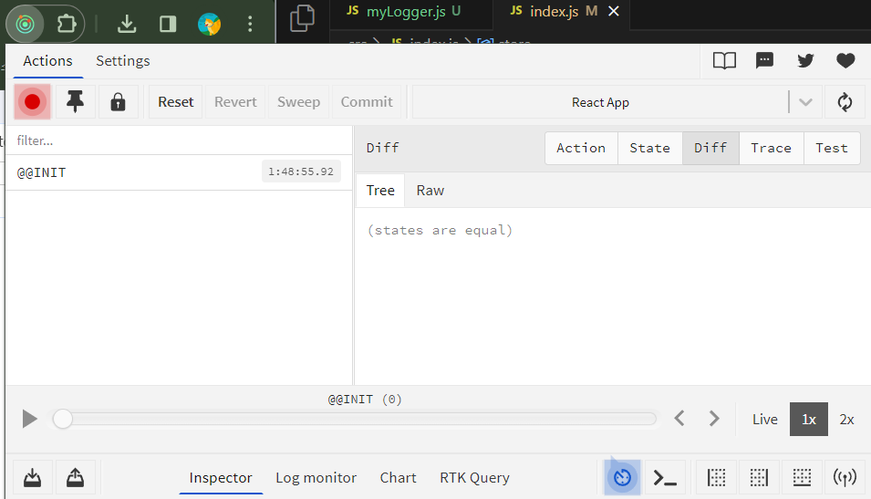

# 리덕스 미들웨어
- 미들웨어는 **함수를 연달아서 두 번 리턴하는 함수**
- 액션을 디스패치로 전달하고 리듀서에 도달하기 전에 지정된 작업을 실행해주는 중간자
## 리덕스 미들웨어 템플릿
```js
const middleware = store => next => action => {
  //something to do...
}
```

```js
//개념상 코드
function middleware(store) {
  return function(next) {
    return function(action) {
      //something to do...
    };
  };
}
```
- `store`: 리덕스 store 인스턴스, dispatch, getState, subscribe등의 내장 함수 들어있음
- `next`: 액션을 다음 미들웨어에게 전달하는 함수
	- `next(action)`형태로 사용
	- 다음 미들웨어가 없다면 리듀서에게 액션 전달
	- `next`를 호출하지 않게 되면 액션이 무시되어 리듀서로 전달 안됨
- `action`: 현재 처리하고 있는 액션 객체
- 액션 값으로 함수도 받아 실행할 수 있음(e.g. redux-thunk)
```js
const thunk = store => next => action =>
  typeof action === 'function'
    ? action(store.dispatch, store.getState)
    : next(action)
```
dispatch할때 아래처럼 사용 가능
```js
const myThunk = () => (dispatch, getState) => {
  dispatch({ type: 'HELLO' });
  dispatch({ type: 'BYE' });
}

dispatch(myThunk());
```
## 미들웨어 작동 원리

![[Pasted image 20240126220802.png]]
1. 새로운 액션이 디스패치되면 첫번째로 등록한 미들웨어 호출
2. 미들웨어에서 `next(action)`을 호출하면 다음 미들웨어로 액션이 넘어감
	1. 미들웨어에서 `store.dispatch`를 사용하면 다른 액션을 추가적으로 발생시킴
3. 액션이 리듀서를 거쳐 store에서 state값을 업데이트 후 반환
- 리덕스 store에는 여러 개의 미들웨어 등록 가능
## 미들웨어 적용하기
### `applyMiddleware from "@reduxjs/toolkit"` 사용하기
- 리덕스 store에 내장된 dispatch함수에 미들웨어를 적용하는 store enhancer를 만듬
- 미들웨어는 비동기 액션을 간결하게 표현하거나, 모든 액션 payload를 로깅하는 등 다양한 작업에 유용하게 사용됨
- 미들웨어는 잠재적으로 비동기식이기 때문에 컴포지션 체인(?)에서 첫번째 store enhancer가 되어야함
Note that each middleware will be given the `dispatch` and `getState` functions as named arguments.
- 각 미들웨어는 `dispatch`와 `getState`함수가 명명된 인수로 제공됨(?)
- _@param_ `middlewares` — 적용할 미들웨어 체인(미들웨어 묶음)
- _@returns_ — 미들웨어를 적용하는 store enhancer
### `configureStore`에 적용하기
- middleware에 사용할 미들웨어를 배열에 담아 콜백 형태로 전달해야함([참고](https://github.com/reduxjs/redux-toolkit/discussions/3945))
```js
const store = configureStore({
  reducer: rootReducer,
  middleware: () => {
    return [logger];
  },
});
```
# redux-logger
- 이전 state값, 액션 타입, 다음(실제로는 현재) state값을 로그에 출력해주는 미들웨어
```
yarn add redux-logger
```

![[Pasted image 20240126225259.png]]
# Redux DevTools 사용법
```
yarn add @redux-devtools/extension
```
- `configureStore`의 `devTools: process.env.NODE_ENV !== 'production',`로 지정하면 됨

# redux-thunk
- 리덕스에서 비동기 작업을 처리하는 미들웨어
- 함수를 디스패치할 수 있음
- 함수를 디스패치할때는 해당 함수에서 `dispatch`와 `getState`를 파라미터로 받아야하고, 이 함수를 만들어주는 함수가 thunk임
- thunk함수에서 async/await 사용 가능
- **redux toolkit을 설치했다면 `configureStore`가 redux thunk를 기본으로 추가해서 따로 설치할 필요 없음**([공식 깃헙](https://github.com/reduxjs/redux-thunk))
```
yarn add redux-thunk //기존 redux를 사용할때
```

> [!info] Redux의 비동기 처리
> Redux의 표준은 액션 내부에서 비동기 작업을 직접 처리하는 것이 아니라, 비동기 작업의 결과를 기다렸다가 해당 결과와 함께 액션을 디스패치하는 것이다?
## `createAsyncThunk()`
- 비동기 로직을 위한 thunk를 만들어 주는 함수
- _@param_ `action type` -- 액션 타입, createSlice의 reducers에 지정한 리듀서 이름, 비동기 작업시 액션 타입에 아래 문자열이 붙은 액션이 **자동으로** 디스패치됨(createSlice의 extraReducer으로 각 액션마다 진행할 작업 직접 설정해줄 수 있음)
	- `pending`: 비동기 요청 진행중
	- `fulfilled`: 비동기 요청 성공
	- `rejected`: 비동기 요청 실패
- _@param_ `payloadCreator()` -- **payload**와 **thunkAPI**를 파라미터로 받는 콜백 함수
	- payload: thunk 액션 생성자로 전달할 값(e.g. API요청에 함께 전달할 id 같은 값)
	- thunkAPI: `dispatch()`, `getState()`를 사용할 수 있도록 해주는 객체
---
- `createAsyncThunk`로 생성된 액션 생성자와 `createSlice`의 `reducers`에 정의된 액션 생성자는 같은 이름을 가질 수 없음
- 일반적으로 비동기 액션 이름에는 'fetch'를 붙임
- `createSlice`의 reducer에는 동기 액션을 넣고 extraReducers에 비동기 액션을 넣음?
```js
import { createSlice, createAsyncThunk } from "@reduxjs/toolkit";
  
export const increaseAsync = createAsyncThunk(
  "increase",
  async (payload, thunkAPI) => 
    return new Promise((resolve) => {
      setTimeout(() => {
        resolve(payload);
      }, 3000);
    });
  }
);
  
export const decreaseAsync = createAsyncThunk(
  "decrease",
  async (payload, thunkAPI) => {
    return new Promise((resolve) => {
      setTimeout(() => {
        resolve(payload);
      }, 3000);
    });
  }
);
  
const initialState = 0;

const counter = createSlice({
  name: "counter",
  initialState,
  reducers: {
    increase(state, action) {
      return state + (action.payload || 1);
    },
    decrease(state, action) {
      return state - (action.payload || 1);
    },
  },
  //비동기 액션 타입 중 일부 작업을 직접 설정
  extraReducers: (builder) => {
    builder
      .addCase(increaseAsync.fulfilled, (state, action) => {
        return state + action.payload;
      })
      .addCase(decreaseAsync.fulfilled, (state, action) => {
        return state - action.payload;
      });
  },
});
  
export const { increase, decrease } = counter.actions;
export default counter.reducer;
```
사용법
```js
import React from "react";
import Counter from "../components/Counter";
import { useSelector, useDispatch } from "react-redux";
import { increaseAsync, decreaseAsync } from "../modules/counter";
  
function CounterContainer() {
  const number = useSelector((state) => state.counter);
  const dispatch = useDispatch();
  
  const onIncrease = () => {
    dispatch(increaseAsync(1)); //payload 전달
  };
  const onDecrease = () => {
    dispatch(decreaseAsync(1)); //payload 전달
  };
  
  return (
    <Counter
      number={number}
      onIncrease={onIncrease}
      onDecrease={onDecrease}
    ></Counter>
  )
}
  
export default CounterContainer;
```

```js
//payload를 전달하지 않는 경우
import { createSlice, createAsyncThunk } from "@reduxjs/toolkit";
  
export const increaseAsync = createAsyncThunk(
  "increase",
  async (payload, thunkAPI) => {
    setTimeout(() => {
      thunkAPI.dispatch(increase(payload));
    }, 3000);
  }
);
  
export const decreaseAsync = createAsyncThunk(
  "decrease",
  async (payload, thunkAPI) => {
    setTimeout(() => {
      thunkAPI.dispatch(decrease(payload));
    }, 3000);
  }
);

const initialState = 0;
  
const counter = createSlice({
  name: "counter",
  initialState,
  reducers: {
    increase(state, action) {
      return state + 1;
    },
    decrease(state, action) {
      return state - 1;
    },
  },
});
  
export const { increase, decrease } = counter.actions;
export default counter.reducer;
```
사용법은 payload만 전달 안하고 나머지는 위의 사용법과 같음
## redux-thunk로 API 요청하기
1. 프로미스가 시작, 성공, 실패했을때 다른 액션을 디스패치해야 함
2. 각 프로미스마다 thunk 함수를 만들어줘야 함
3. 리듀서에서 액션에 따라 로딩중(시작), 결과(성공), 에러(실패) 상태를 변경해줘야 함
```js
import { createAsyncThunk, createSlice } from "@reduxjs/toolkit";
import * as postsAPI from "../api/posts";
import { reducerUtils } from "../lib/asyncUtils";
  
export const fetchPosts = createAsyncThunk(
  "posts/getPosts",
  async (payload, thunkAPI) => {
    const response = await postsAPI.getPosts();
    return response;
  }
);
  
export const fetchPostById = createAsyncThunk(
  "posts/getPost",
  async (postId, thunkAPI) => {
    const response = await postsAPI.getPostById(postId);
    return response;
  }
);
  
const initialState = {
  posts: reducerUtils.initial(),
  post: reducerUtils.initial(),
};
  
const postsSlice = createSlice({
  name: "posts",
  initialState,
  reducers: { //동기 액션 처리
    getPosts(state, action) {
      return {
        ...state,
        posts: reducerUtils.loading(),
      };
    },
    getPostsSuccess(state, action) {
      return {
        ...state,
        posts: reducerUtils.success(action.payload),
      };
    },
    getPostsError(state, action) {
      return {
        ...state,
        posts: reducerUtils.error(action.error),
      };
    },
    getPost(state, action) {
      return {
        ...state,
        post: reducerUtils.loading(),
      };
    },
    getPostSuccess(state, action) {
      return {
        ...state,
        post: reducerUtils.success(action.payload),
      };
    },
    getPostError(state, action) {
      return {
        ...state,
        post: reducerUtils.error(action.error),
      };
    },
  },
  extraReducers: (builder) => { //비동기 액션 처리
    builder
      .addCase(fetchPosts.pending, (state, action) => {
        state.posts = reducerUtils.loading();
      })
      .addCase(fetchPosts.fulfilled, (state, action) => {
        state.posts = reducerUtils.success(action.payload);
      })
      .addCase(fetchPosts.rejected, (state, action) => {
        state.posts = reducerUtils.error(action.error);
      })
      .addCase(fetchPostById.pending, (state, action) => {
        state.post = reducerUtils.loading();
      })
      .addCase(fetchPostById.fulfilled, (state, action) => {
        state.post = reducerUtils.success(action.payload);
      })
      .addCase(fetchPostById.rejected, (state, action) => {
        state.post = reducerUtils.error(action.error);
      });
  },
});
  
export const {
  getPosts,
  getPostsSuccess,
  getPostsError,
  getPost,
  getPostSuccess,
  getPostError,
} = postsSlice.actions;
export default postsSlice.reducer;
```
### 비동기 액션 사용법
1. export하는 비동기 액션을 import
2. `useSelector`에서 state를 콜백으로 받기
```js
import React, { useEffect } from "react";
import { useSelector, useDispatch } from "react-redux";
import { fetchPostById } from "../modules/posts";
import Post from "../components/Post";
  
const PostContainer = ({ postId }) => {
  const { loading, data, error } = useSelector((state) => state.posts.post);
  const dispatch = useDispatch();
  
  useEffect(() => {
    dispatch(fetchPostById(postId));
  }, [postId, dispatch]);
  
  if (loading) return <div>loading...</div>;
  if (error) return <div>error!!</div>;
  if (!data) return null;
  
  return <Post post={data} />;
};
  
export default PostContainer;
```
### 뒤로가기 시 리로딩 해결하기
- 뒤로가기하면 API를 다시 요청하면서 리로딩됨
- 아예 리로딩하지 않거나, 리로딩을 하지만 로딩 상태를 표시안하는 방법이 있음
#### 리로딩하지 않는 방법
```js
import React, { useEffect } from "react";
import { useSelector, useDispatch } from "react-redux";
import PostList from "../components/PostList"

import { fetchPosts } from "../modules/posts";
  
const PostListContainer = () => {
  const { loading,data, error } = useSelector((state) => state.posts.posts);
  const dispatch = useDispatch();
  
  useEffect(() => {
    if (data) return;
    dispatch(fetchPosts());
  }, [data, dispatch]);
  
  if (loading) return <div>loading...</div>;
  if (error) return <div>error!!</div>;
  if (!data) return null;
  return <PostList posts={data} />;
};
  
export default PostListContainer;
```
#### 리로딩하지만, 로딩 상태 표시 안하는 방법
- 사용자에게 최신 정보를 보여줄 수 있음
- createAsyncThunk에서 처리하는 방법 모르겠음
### 이미 요청한 API 재요청하지 않기
- 특정 포스트를 조회하고 뒤로 갔다가 다시 들어가면 리로딩됨
- 어떤 파라미터가 주어졌냐에 따라 결과물이 달라져 앞의 방법으로 해결할 수 없음
#### 컴포넌트가 언마운트될때 상태값 비우기
1. 비우는 액션과 리듀서 추가하기
2. `useEffect`의 cleanup함수에서 해당 액션 디스패치하기
```js
useEffect(() => {
    dispatch(fetchPostById(postId));
    return () => {
      dispatch(clearPost()); //비우는 액션 디스패치
    };
  }, [postId, dispatch]);
```
3. initialState 구조 바꾸기 --> 다른 방식 찾아보기
## thunk에서 라우터 사용하기
- thunk함수내에서 라우터를 사용해야할때: 로그인 요청시 로그인 성공하면 특정 경로로 이동시키고, 실패하면 경로 유지 등
- react-route의 `useNavigete`사용해서 라우트 이동하기
1. 리듀서 파일에 `useNavigate`를 인자로 받는 경로 이동 함수 추가
```js
export const goToHome = (navigate) => (dispatch, getState) => {
  navigate("/");
};
```
- dispatch, getState 사용법
```js
export const goToHome = (navigate) => (dispatch, getState) => {
  console.log(getState().posts);
  dispatch({type: 'GET_POSTS'})
  navigate("/");
};
```

2. dispatch와 함께 `useNavigate`를 넘겨주기
```js
import React, { useEffect } from "react";
import { useSelector, useDispatch } from "react-redux";
import { fetchPostById, clearPost, goToHome } from "../modules/posts";
import Post from "../components/Post";
import { useNavigate } from "react-router-dom";
  
const PostContainer = ({ postId }) => {
  const loading = useSelector((state) => state.posts.post.loading);
  const data = useSelector((state) => state.posts.post.data);
  const error = useSelector((state) => state.posts.post.error);
  const navigate = useNavigate();
  
  const dispatch = useDispatch();
  
  useEffect(() => {
    dispatch(fetchPostById(postId));
    return () => {
      dispatch(clearPost());
    };
  }, [postId, dispatch]);
  
  if (loading) return <div>loading...</div>;
  if (error) return <div>error!!</div>;
  
  return (
    <>
      <button onClick={() => dispatch(goToHome(navigate))}>home</button>
      {data && <Post post={data} />}
    </>
  );
};
  
export default PostContainer;
```
# redux-saga