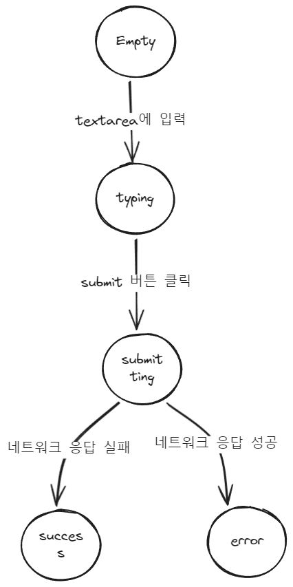

# 선언적 UI vs 명령적 UI
- 명령적 UI 프로그래밍은 각 html 요소를 명령해 컴퓨터에게 UI를 업데이트하는 방법을 알려줌
- 명령적 UI 프로그래밍은 리액트를 사용하지 않고 브라우저 DOM만 사용
- 명령적 UI 프로그래밍은 복잡한 시스템일수록 관리하기 어려워짐
- 리액트는 UI를 직접 조작하지 않는 대신 표시할 UI를 설명하고, 리액트가 UI를 업데이트하는 방법을 결정함

# 사용자 입력 state 처리
## 1. 사용자가 볼 수 있는 UI의 다양한 "상태" 시각화
- 먼저 어떤 상태가 필요한지 파악하기
- UI의 어떤 상태에 대한 모킹을 만들어 로직을 추가하기 전에 빠르게 UI가 어떻게 변하는지 확인하기
```jsx
export default function Form({
	// status라는 값이 변할때 UI가 어떻게 변하는지 만들어보기
	status = 'empty' // 'submitting', 'error', 'success'
}) {
	if (status === 'success') {
		return <h1>That's right!</h1>
	}
	return (
		<>
			<form>
				<textarea disabled={status === 'submitting'} />
		        <br />
		        <button disabled={
		          status === 'empty' ||
		          status === 'submitting'
		        }>
		          Submit
		        </button>
		        {status === 'error' &&
		          <p className="Error">
		            Good guess but a wrong answer. Try again!
		          </p>
		        }
		    </form>
		</>
	)
}
```
- 많은 시각적 상태가 있는 경우 한 페이지에 모든 상태에 대한 UI를 표시하는게 편함
```jsx
import Form from './Form.js';
  
let statuses = [
  'empty',
  'typing',
  'submitting',
  'success',
  'error',
];
  
export default function App() {
  return (
    <>
      {statuses.map(status => (
        <section key={status}>
          <h4>Form ({status}):</h4>
          <Form status={status} />
        </section>
      ))}
    </>
  );
}
```

## 2. 상태 변경을 트리거하는 입력 확인
| 상태 변경을 트리거하는 입력 |                                    |
| -------------------------------- | ---------------------------------- |
| 사용자 입력                      | 버튼 클릭, 필드 입력, 링크 탐색 등 |
| 컴퓨터 입력|네트워크 응답 도착, 타임아웃 완료, 이미지 로딩 등|
- 사용자 입력과 컴퓨터 입력 모두 상태 변수를 설정하여 UI를 업데이트해야함
- 1번의 Form 컴포넌트에서 상태 변경을 트리거하는 입력
	- 텍스트 입력 변경(사용자 입력): `textarea`가 비어있는지 여부에 따라 empty 상태나 typing 상태가 됨
	- 제출 버튼 클릭(사용자 입력): submitting 상태로 전환
	- 네트워크 응답 성공(컴퓨터 입력): success 상태로 전환
	- 네트워크 응답 실패(컴퓨터 입력): error 상태와 해당하는 에러 메시지로 전환
- 상태 흐름을 도식으로 그려보기


## 3. `useState`를 사용해 상태를 메모리에 표현
- 일단은 가능한 모든 상태를 지정하고 리팩토링하기
```jsx
const [answer, setAnswer] = useState(''); //입력에 대한 답변
const [error, setError] = useState(null); //오류
const [isEmpty, setIsEmpty] = useState(true); //입력이 비었는지 여부
const [isTyping, setIsTyping] = useState(false); //입력이 있는지 여부
const [isSubmitting, setIsSubmitting] = useState(false); //제출중인지 여부
const [isSuccess, setIsSuccess] = useState(false); // 네트워크 응답 성공 여부
const [isError, setIsError] = useState(false); //네트워크 응답 실패 여부
```

## 4. 필요하지 않은 상태 변수 제거
- 반드시 필요한 상태들만 `useState`로 지정해서 최소한의 상태들만 유지하기
- 상태 구조를 리팩토링해서 상태가 사용자가 보기를 원하는 UI를 나타내지 않는 경우 방지 (e.g. 에러메시지를 표시하고 입력을 비활성화하면 사용자가 오류를 수정할 수 없게 됨)
	- 모순을 일으키는 상태가 있는가?
	  e.g. isTyping과 isSubmitting은 동시에 true일 수 없음 --> 하나의 상태로 결합하기
	- 동일한 정보를 이미 다른 상태 변수에서 사용할 수 있는가?
	  e.g. isEmpty와 isTyping은 동시에 true일 수 없음 --> isEmpty를 제거하고 상태를 사용하지 않는 방식으로 대체하기
	- 어떤 상태 값을 다른 상태 값으로 얻을 수 있는가?
	  e.g. isError는 `error !== null`과 같음
```jsx
//상태 구조 리팩토링 결과
const [answer, setAnswer] = useState('');
const [error, setError] = useState(null);
const [status, setStatus] = useState('typing'); //'typing', 'submitting', 'success'
```

## 5. 이벤트 핸들러를 연결해 상태 설정
- 상태를 업데이트하는 이벤트 핸들러를 만들고 요소의 이벤트 속성에 연결하기
```jsx
import { useState } from 'react';

export default function Form() {
	const [answer, setAnswer] = useState('');
	const [error, setError] = useState(null);
	const [status, setStatus] = useState('typing');

	if (status === 'success') {
		return <h3>Submit Success!</h3>
	}

	async function handleSubmit(e) {
		e.preventDefault();
		setStatus('submitting');
		try {
			await submitForm(answer);
			setStatus('success');
		} catch (err) {
			setStatus('typing'); //에러 발생시 입력 수정할 수 있게함
			setError(err);
		}
	}

	function handleTextareaChange(e) {
		setAnswer(e.target.value);
	}

	return (
		<>
			<form onSubmit={handleSubmit}>
				<textarea
					value={answer}
					onChange={handleTextareaChange}
					disabled={status === 'submitting'}
				/>
				<br />
				<button disabled={
					answer.length === 0 || status === 'submitting'
				}>					
					Submit
				</button>
				{error !== null &&
					<p>{error.message}</p> //에러 발생시 error값은 catch문에서 넘겨받은 err값으로 설정됨
				}
			</form>
		</>
	);
}

function submitForm(answer) {
	//서버에 요청하고 응답 받는 로직
}
```

# 상태 구조 원칙
## 관련된 상태들은 그룹화하기
- 항상 동시에 업데이트되는 2개 이상의 상태 변수들은 하나로 합치는 걸 고려하기
- 얼마나 많은 상태가 필요한지 모를때도 그룹화하면 좋음
- 상태 변수를 객체로 묶고 하나의 상태 변수만 변경하려면
	  `setPosition({...position, x:100)}`처럼 spread 구문 사용
## 여러 상태가 서로 모순되거나 불일치하는 경우 피하기
- 하나의 상태로 서로 다른 변수값을 나타내도록 바꾸기
```jsx
import { useState } from 'react';

export default function FeedbackForm() {
	const [text, setText] = useState('');
	const [status, setStatus] = useState('typing');
	//const [isSending, setIsSending] = useState(false);
	//const [isSent, setIsSent] = useState(false);
	
	async function handleSubmit(e) {
		e.preventDefault();
		setStatus('sending');
		await sendMessage(text);
		setStatus('sent');
	}

	//하나의 상태로 2개의 기존 상태들을 대체함
	const isSending = status === 'sending';
	const isSent = status === 'sent';
	...
}
```
## 중복 상태 피하기
- 렌더링 중에 어떤 props나 상태 변수에서 한 상태 정보를 계산할 수 있으면 중복되는 것이므로 중복되는 해당 상태를 제거하기
- 상태 변수 초기화값에 props 사용하지 않기(미러링하지 말기): 부모 컴포넌트가 나중에 다른 props값을  전달해도 자식 컴포넌트의 상태 변수 값은 업데이트 되지 않고 최초 렌더링시 지정한 초기값을 유지함
```jsx
//props값으로 상태값이 고정됨
function Message({ messageColor }) {
	const [color, setColor] = useState(messageColor);
	...
}

//props값이 바뀌면 상태값도 바뀜
function Message({ messageColor }) {
	const color = messageColor;
	...
}
```
- 특정 props에 대한 모든 업데이트를 무시하고 싶을때만 미러링하기, 이때는 props이름 앞에 `initial`또는 `default`을 붙여 업데이트되지 않는다는걸 명확히하기
## 상태에서 (데이터)중복 피하기
- 여러 상태 변수 간에 또는 중첩된 객체 내에서 동일한 데이터가 중복되면 동기화 상태를 유지하기 어려움
	- 중복된 상태:
	  `items = [{ id: 0, title: 'pretzels'}, ...]`
	   `selectedItem = {id: 0, title: 'pretzels'}`
	- 중복을 제거한 상태:
	  `items = [{ id: 0, title: 'pretzels'}, ...]`
	  `selectedId = 0` --> `selectedId`로 `selectedItem`을 찾음
## 깊게 중첩된 상태 피하기
- 평탄화(정규화): 깊게 계층화된 상태 변수(리터럴 객체)는 업데이트하기 불편하므로 평평하게 구조 변환하기
- 컴포넌트 분리: 중접된 상태의 일부를 하위 컴포넌트로 이동시키기 --> 마우스 hover 여부 처럼 저장할 필요 없는 임시 UI 상태에 효과적임
[맨 밑에 문제 풀어보기](https://react.dev/learn/choosing-the-state-structure)

# 컴포넌트 간 state 공유(상태 끌어올리기)
- 컴포넌트 간 상태를 공유하려면 개별 컴포넌트에 상태를 두지 말고 모두를 포함하는 상위의 가장 가까운 컴포넌트에 상태를 두어 하위 컴포넌트에 props로 전달하면 됨
- 상태 끌어올리기에서는 고유한 각 상태들을 모두 가진 컴포넌트가 있어야 함: 모든 상태가 한 곳에 존재해야 한다는 의미가 아니라, 상태를 공유하기 위해 컴포넌트 간에 공유 상태를 복제하는 대신 공유 상태를 공통 부모 컴포넌트로 올리고 필요한 자식 컴포넌트에 전달하기 위함임
1. 자식 컴포넌트에서 상태 제거하고 props로 대체
2. 공통 부모 컴포넌트에서 props 전달
3. 공통 부모 컴포넌트에 적절한 상태를 추가하고 이벤트 핸들러와 함께 하위 컴포넌트에 전달
	- 상태값을 props로 전달하거나
	- 상태값을 이용해서 계산한 값을 props로 전달
```jsx
export default function MyApp() {
  const [count, setCount] = useState(0);

  function handleClick() {
    setCount(count + 1);
  }

  return (
    <div>
      <h1>함께 업데이트되는 카운터</h1>
      //handleClick 이벤트 핸들러를 onClick prop로 전달
      //count 상태 값을 count prop로 전달
      <MyButton count={count} onClick={handleClick} /> 
      <MyButton count={count} onClick={handleClick} />
    </div>
  );
}

function MyButton({ count, onClick }) {
  return (
    <button onClick={onClick}>
      {count}번 클릭됨
    </button>
  );
}
```

> [!비제어(uncontrolled) 컴포넌트 vs 제어(controlled) 컴포넌트]
> - 비제어 컴포넌트: 로컬 상태를 가진 자식 컴포넌트로, 부모 컴포넌트가 자식 컴포넌트의 상태를 변경할 수 없음
> - 제어 컴포넌트: 중요한 정보가 props에 의해 결정되는 자식 컴포넌트로, 부모 컴포넌트가 자식 컴포넌트의 동작을 제어할 수 있음
> - 비제어 컴포넌트는 구성 요소가 적어 부모 컴포넌트 내에서 사용하기 쉬움
> - 여러 컴포넌트를 함께 조율하려는 경우 제어 컴포넌트가 훨씬 유연함
> - 제어 컴포넌트는 부모 컴포넌트가 props를 구성해줘야함
> - 컴포넌트를 만들때 어떤 상태가 props로 제어되어야하는지, 로컬 상태로 제어되어야 하는지 고려해야함

# state 보존과 재설정
- 리액트는 UI를 관리하고 모델링하기 위해 트리 구조를 사용함
- JSX로부터 UI 트리를 만듬
- React DOM은 브라우저 DOM 요소를 UI트리와 일치하도록 업데이트함
- React Native는 트리를 모바일 플랫폼에 특화된 요소로 변환함
- 상태는 컴포넌트 내에 존재하지 않고 리액트 내부에 보관됨
- 리액트는 UI 트리 내의 위치를 기반으로 어떤 상태가 어떤 컴포넌트에 속하는지 추적함
- **동일한 위치에 동일한 컴포넌트가 렌더링되면 상태를 보존함**
	- 조건부 렌더링시 컴포넌트의 UI 트리 내의 위치가 바뀌지 않는다면 상태는 보존됨
	- JSX 마크업이 아닌 UI 트리 내의 위치를 생각해서 상태 보존 여부 판단하기
- **동일한 위치에 다른 컴포넌트가 렌더링되면 하위 트리 전체가 파괴되며 상태를 리셋함**
- **재렌더링 사이에서 상태를 보존하려면 트리의 구조, 즉 JSX 요소가 변하면 안됨**
- 컴포넌트내에 컴포넌트를 정의하며 중첩해버리면, 외부 컴포넌트가 렌더링될때마다 내부 컴포넌트가 새로 생성됨(동일한 위치에서 다른 컴포넌트를 렌더링)
## 동일한 위치에 있는 컴포넌트의 상태 리셋하기
### 방법 1: 서로 다른 위치에 컴포넌트 렌더링하기
```jsx
<div>
	{isPlayerA ? (
		<Counter person="Taylor" />
	) : (
		<Counter person="Sarah" />
	)}
	<button onClick={() => {
		setIsPlayerA(!isPlayerA);
	}}>
		Next player!
	</button>
</div>
```
위의 상황은 하나의 조건문만 사용해 동일한 위치에 동일한 컴포넌트가 렌더링됨

```jsx
<div>
	{isPlayerA &&
		<Counter person="Taylor" />
	}
	{!isPlayerA &&
		<Counter person="Sarah" />
	}
	<button onClick={() => {
		setIsPlayerA(!isPlayerA);
	}}>
		Next player!
	</button>
</div>
```
**조건문을 2개로 만들어** 동일한 컴포넌트를 렌더링하면 각자 다른 위치에 렌더링됨
--> 동일한 위치에 렌더링되는 독립적인 컴포넌트 개수가 적을 때만 사용

### 방법 2: 각 컴포넌트에 key를 명시적으로 부여하기
- 컴포넌트에 key를 부여하면 트리의 어느 위치에 나타나더라도 리액트는 key값으로 컴포넌트를 인식함
- 추가한 key는 따로 props로 넘겨줄 필요 없음. 고유 속성임
- 리액트는 컴포넌트의 순서 대신 키 자체로 위치를 판단함
- JSX에서 동일한 위치에 렌더링 되지만 리액트는 서로 다른 컴포넌트로 인식해 상태를 보존하지 않음
```jsx
{isPlayerA ? (
  <Counter key="Taylor" person="Taylor" />
) : (
  <Counter key="Sarah" person="Sarah" />
)}
```

## 제거된 컴포넌트의 상태 보존
- 모든 컴포넌트를 렌더링하고 제거하고 싶은 컴포넌트는 CSS로 숨기기 --> DOM 노드가 많아질수록 매우 느려짐
- 상태를 상위 컴포넌트로 올리고 각 하위 컴포넌트의 상태 값을 부모 컴포넌트에 저장하기 --> 하위 컴포넌트가 제거되어도 상위 컴포넌트에 값이 저장되있음
- 브라우저의 localStorage 이용하기

# Reducer
- 컴포넌트에서 여러 이벤트 핸들러에 걸쳐 상태 업데이트가 분산되는 경우 컴포넌트 외부에 모든 상태 업데이트 로직을 담은 단일 함수인 reducer 만들기

## `useState`에서 `useReducer`로 마이그레이션하기
### 1. "상태 설정 로직"을 "액션을 디스패치"하는 방식으로 전환하기
- 액션: 디스패치 함수에 전달하는 객체
- 액션 객체는 어떤 형태든지 가질수 있지만 관례적으로 type필드를 넣음
- type필드: **발생한 일을 설명하는 문자열 타입**
- 각 액션은 사용자 상호작용 하나를 설명해야 함
1. 이벤트 핸들러의 상태 setter를 사용하는 상태 설정 로직 삭제하기
2. 디스패치 함수에 액션 객체 전달하기
```jsx
let nextId = 3;

function handleAddTask(text) { 
	setTasks([
		...tasks, 
		{ id: nextId++, text: text, done: false, }, 
	]); 
}
...

//액션 디스패치 방식으로 전환
function handleAddTask(text) {
	dispatch({
		type: 'added', 
		id: nextId++, 
		text: text, 
	}); 
}

function handleChangeTask(task) {
	dispatch({
	  type: "changed",
	  task: task,
	});
}
  
function handleDeleteTask(taskId) {
	dispatch({
	  type: "deleted",
	  id: taskId,
	});
}
```
### 2. Reducer함수 작성하기
- Reducer함수는 **현재 상태**와 **액션 객체** 두가지 인수를 받고 **다음 상태** 반환
- Reducer에서 반환한 값을 리액트가 상태로 설정함
- 모든 상태 설정 로직을 Reducer함수로 마이그레이션하기
- 관례적으로 Reducer함수 내부 로직은 **switch문** 사용
> [!Reducer함수 내부 로직 작성시 주의 사항]
> - 각 case문이 return으로 끝나야 의도치 않게 다음 case문을 실행하지 않음
> - 각 type의 case문에 전달된 action은 그 action을 가진 디스패치 함수에 속하기 때문에 다른 디스패치 함수의 action객체의 필드는 사용 못함
> - Reducer는 렌더링 중에 실행되므로 **순수 함수**로 작성해야함([[React 기초#컴포넌트의 순수성 유지하기]])
- Reducer함수는 원한다면 다른 파일로 이동할 수 있음
```jsx
function yourReducer(state, action) {
	//리액트에서 설정할 다음 상태 반환
}
```
- Reducer함수는 배열의 `reduce()`메서드와 동일한 개념임
	- `reduce()`는 지금까지의 결과와 현재 항목을 받아 다음 결과 반환
	- Reducer함수는 현재 상태와 액션을 받아 다음 상태 반환
```jsx
function tasksReducer(tasks, action) {
  switch (action.type) {
    case "added": {
     return [...tasks, { id: action.id, text: action.text, done: false }];
    }
    case "changed": {
      return tasks.map((t) => {
        if (t.id === action.task.id) {
          return action.task;
        } else {
          return t;
        }
      });
    }
    case "deleted": {
      return tasks.filter((t) => t.id !== action.id);
    }
    default: {
      throw Error("Unknown action: " + action.type);//type은 모든 액션에서 가진 공통 속성이므로 default문에서 사용 가능
    }
  }
}
```

### 3. 컴포넌트에서 Reduce 사용하기
1. `import { useReducer } from 'react';`
2. `useState`를 `useReducer`로 대체하기
	`[state, dispatch] = useReducer(yourReducer, initialState)`
	- `useReducer`의 `dispatch`는 이벤트 핸들러에서 dispatch함수로 사용됨
```jsx
const [tasks, setTasks] = useState(initialTasks);
//-->
const [tsaks, dispatch] = useReducer(tasksReducer, initialTasks);
```
- 이벤트 헨들러는 액션을 디스패치해 어떤 일이 발생했는지 지정하며, Reducer함수는 상태가 어떻게 업데이트되는지 결정함함

## `useState`vs `useReducer`
- 코드 양: 많은 이벤트 핸들러에서 상태를 유사한 방식으로 수정하는 경우, `useReducer`를 사용하면 코드 양을 줄일 수 있음
- 가독성: 상태 업데이트가 간단한 경우에는 `useState`가 훨씬 읽기 쉬움. 복잡해지면 `useReducer`로 업데이트 로직의 "어떻게"와 이벤트 핸들러의 "무슨일이 발생했는지"를 깔끔하게 분리할 수 있음
- 디버깅: `useState`에서 버그가 발생하면, 상태가 잘못 설정된 위치와 그 이유를 찾기 어려움. `useReducer`는 Reducer에 콘솔 로그를 추가해 모든 상태 업데이트와 어떤 액션 때문에 발생했는지를 확인할 수 있고, 각 액션이 올바른 경우 리듀서 로직 자체에 오류가 있음을 알 수 있음
- 테스트: Reducer는 컴포넌트에 의존하지 않는 순수 함수이므로 독립적으로 테스트할 수 있음. 복잡한 상태 업데이트 로직은 특정 초기 상태와 액션에 대해 Reducer가 특정 상태를 반환하는지 확인하는 것이 유용할 수 있음
- `useState`와 `useReducer`를 함께 사용해도 됨

## Immer로 간결한 Reducer 작성하기
- `import { useImmerReducer } from 'use-immer';`
- `[state, dispatch] = useImmerReducer(yourReducer, initialState);`
- Immer 라이브러리는 상태의 사본인 draft 객체를 제공하기 때문에 `useImmerReducer`로 관리되는 Reducer는 첫 번째 인수를 직접 변경할 수 있으며 상태를 반환할 필요 없음
```jsx
function tasksReducer(draft, action) {
	switch (action.type) {
		case 'added': {
			draft.push({
				id: action.id,
				text: action.text,
				done: false,
			});
			break;
		}
		case 'changed': {
			 const index = draft.findIndex((t) => t.id === action.task.id);
			 draft[index] = action.task;
			 break;
		}
		case 'deleted': {
			return draft.filter((t) => t.id !== action.id);
		}
		default: {
			throw Error('Unknown action: ' + action.type);
		}
	}
}
```

# Context
> [!prop drilling]
> 많은 컴포넌트가 동일한 props를 필요로 하는 경우에 멀리 떨어진 컴포넌트가 포함되는 높이까지 "상태 끌어올리기"를 하면 props 전달이 장황하고 불편해지는 것
- context는 props 전달의 대체재임
- context를 사용하면 부모 컴포넌트가 하위 트리의 모든 컴포넌트에게 일부 정보를 제공할수 있고 명시적으로 props를 전달하지 않아도 됨
- context는 하위 트리가 필요로하는 모든 정보를 전달할 수 있음(e.g. 상태 값, 현재 색상 테마, 현재 로그인한 사용자 등)

## 1. 컨텍스트 생성
- 필요로하는 컴포넌트에서 사용할 수 있도록 **컨텍스트 파일 생성**
- `createContext(기본값)`: 기본 값으로 모든 자바스크립트 값을 전달할 수 있음
```jsx
//LevelContext.js
import { createContext } from 'react';

export const LevelContext = createContext(1);
```

## 2. 데이터를 필요로 하는 컴포넌트에서 해당 컨텍스트 사용
1. 컨텍스트 값을 필요로하는 컴포넌트 파일에서 `useContext`와 해당 컨텍스트를 import하기
2. 기존에 사용하던 prop를 제거하고 import한 컨텍스트 값을 `useContext`에 전달
	- `useContext(컨텍스트)`: 해당 컴포넌트가 `컨텍스트`를 읽고자 한다는 것을 리액트에 알려줌
```jsx
export default function Heading({ level, children }) {
	...
}
//-->
export default function Heading({ children }) {
	const level = useContext(LevelContext);
	...
}
```
3. 자식 컴포넌트에서 사용하던 기존 prop를 부모 컴포넌트로 이동(상태 끌어올리기)

## 3. 데이터를 지정하는 컴포넌트에서 해당 컨텍스트 제공
1. 부모 컴포넌트에서 자식 컴포넌트 렌더링하기
2. `<YourContext.Provider value={state}>`로 자식 컴포넌트 감싸기
- 감싸진 컴포넌트가 해당 컨텍스트를 요청하면 `value`에 지정한 state값을 제공함 
```jsx
import { LevelContext } from './LevelContext.js';

export default function Section({ level, children }) {
  return (
    <section className="section">
      <LevelContext.Provider value={level}>
        {children}
      </LevelContext.Provider>
    </section>
  );
}
```
- 자식 컴포넌트는 `useContext(해당 컨텍스트)`를 사용해 위에서 가장 가까운 해당 컨텍스트 값을 요청함
```jsx
export default function Page() {
	return (
		<Section level={1}>
			<Heading>title</Heading>
		</Section>
	);
}
```

### 동일한 컴포넌트에서 컨텍스트 사용과 제공
- 부모 컴포넌트에서 `useContext`를 사용하면 부모 컴포넌트를 사용하는 곳에서 props 값을 지정하지 않아도 자동으로 동일한 다음 컴포넌트로 업데이트된 값이 전달됨
```jsx
import { useContext } from 'react';
import { LevelContext } from './LevelContext.js';

export default function Section({ children }) {
  const level = useContext(LevelContext);
  return (
    <section className="section">
      <LevelContext.Provider value={level + 1}> {/*초기 value로 0+1이 전달됨*/}
        {children}
      </LevelContext.Provider>
    </section>
  );
}
```

```jsx
export default function Page() {
	return (
		<Section>
			<Heading>title</Heading>
		</Section>
	);
}
```
- 컨텍스트를 사용하면 컴포넌트를 주변에 맞게 조정해 렌더링되는 위치에 따라 다르게 표시할 수 있음
- 컨텍스트는 CSS 속성 상속처럼 다른 컨텍스트를 덮어쓰지 않음
- `createContext()`로 만든 각 컨텍스트는 완전히 다른 것으로 간주되어 한 컴포넌트가 문제없이 여러 다른 컨텍스트를 사용하거나 제공할 수 있음

## 컨텍스트 사용 전 고려할 점
- 일부 props를 여러 수준으로 전달해야 한다고 해서 그 props를 컨텍스트에 넣어야 하는 건 아님
- 먼저 props를 직접 전달하기: 어떤 데이터를 사용하는지 명확히 표시해 코드를 유지보수하기 쉬움
- 컴포넌트를 추출하고 JSX를 자식으로 전달하기: props값을 사용하지 않는 중간 컴포넌트에 props를 전달하고 있다면 자식 컴포넌트를 불러와 props를 직접 받도록 만들면 데이터가 전달되는 계층 수가 줄어듬

## 컨텍스트 사용 사례
- 테마 지정: 사용자가 앱의 외관을 변경할 수 있는 경우(e.g. 다크모드), 앱의 맨 위에 컨텍스트 제공자를 놓고 시각적인 모양을 조정하는 컴포넌트에서 해당 컨텍스트를 사용할 수 있음
- 현재 계정: 현재 계정 정보를 컨텍스트에 넣어 어디서든 해당 정보를 사용할 수 있게 함. 동시에 여러 계정을 사용할 경우 일부 UI를 다른 현재 계정 값으로 감싸는 중첩된 Provider를 만들 수 있음
- 라우팅: 대부분의 라우팅 솔루션은 현재 경로를 저장하기 위해 내부적으로 컨텍스트 사용
- 상태 관리: 복잡하고 멀리떨어진 상태를 관리하기 위해 Reducer와 Context를 함께 사용

# Reducer와 Context 결합하기
- 컴포넌트의 `useReducer`의 state와 dispatch함수를 다른 컴포넌트에서 사용하려면 props를 통해 전달하면 됨
- 컴포넌트의 `useReducer`의 state와 dispatch함수를 컨텍스트에 넣으면 해당 컴포넌트의 하위 트리에 있는 어떤 컴포넌트든 반복적인 prop drilling 없이 state를 읽거나 액션을 디스패치할 수 있음

## 1. 컨텍스트 생성
- 하나의 `useReducer`당 **state를 저장하는 컨텍스트**와 **dispatch함수를 저장하는 컨텍스트**, 총 2개의 컨텍스트 생성해야함
```jsx
import { createContext } from 'react';

export const TasksContext = createContext(null);//tasks 저장
export const TasksDispatchContext = createContext(null);//dispatch함수 저장
```

## 2. state와 dispatch를 컨텍스트에 넣기
- 전달할 `useReducer`가 있는 컴포넌트에 컨텍스트를 import해  전체 트리를 컨텍스트 프로바이더로 감싸기
- 이때 프로바이더의 `value`에 state, dispatch 넣어줘야함
- 기존에 props로 전달하던 코드 삭제하기
```jsx
import { TasksContext, TasksDispatchContext } from './TasksContext.js';
...
	<TasksContext.Provider value={tasks}>
		<TasksDispatchContext.Provider value={dispatch}>
			<h1>Day off in Kyoto</h1>
			<AddTask/>
			<TaskList/>
		</TasksDispatchContext.Provider>
	</TasksContext.Provider>
...
```

## 3. 컨텍스트 사용하기
- state 또는 dispatch가 필요한 어떤 하위 컴포넌트든 `useContext`를 사용해 읽고 호출할 수 있음
- 컨텍스트를 받는 컴포넌트에서 기존에 사용하던 props들 중 컨텍스트로 대체된 props들은 제거하기 

## 한데 모으고 사용자 정의 hook 만들기
- Reducer와 Context를 하나의 파일로 합치고 해당 파일에서 **Provider 컴포넌트를 선언하기**
- **사용자 정의 hook 만들기**: 각 컨텍스트마다 `useContext`를 사용하는 hook을 작성해서 내보내기 --> 컨텍스트를 사용하는 곳에서 직접 컨텍스트 import 안해도 됨
```jsx
//TasksContext.js
import { createContext, useReducer } from 'react';

//Context
export const TasksContext = createContext(null);
export const TasksDispatchContext = createContext(null);

//사용자 정의 hook
export function useTasks() {
	return useContext(TasksContext);
}

export function useTasksDispatch() {
	return useContext(TasksDispatchContext);
}

//Provider컴포넌트
export function TasksProvider({ children }) {
	const [tasks, dispatch] = useReducer(tasksReducer, initialTasks);
	
	return (
		<TasksContext.Provider value={tasks}>
			<TasksDispatchContext.Provider value={dispatch}>
				{children}
			</TasksDispatchContext.Provider>
		</TasksContext.Provider>
	);
}

//Reducer
function tasksReducer(tasks, action) {
	...
}

const initialTasks = [...]
```