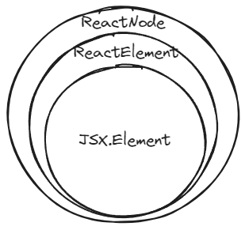

# TS 사용하는 이유
- javascript는 하위호환성을 중시하는 언어로, 사양의 근본적인 업데이트가 어렵습니다.
- 대규모 웹 애플리케이션 개발시 타입이 없는 javascript는 컴파일 시 에러를 검출할 수 없고, 실행 시 버그가 발생하기 쉽습니다.
- typescript는 정적 타입 언어로, 컴파일 시 에러를 검출할 수 있고, 타입에 의한 코드 안정성이 향상됩니다. 그리고 모듈 구조를 가져 대규모 개발에 유리합니다.
- ts는 js의 상위호환 언어이기 때문에 js 코드는 그대로 ts 코드로서 작동합니다.
- TS는 빌드 도구를 통해 JS로 변환됩니다.
- ts는 js에 주로 다음 기능을 추가한 것입니다.
	- 타입 정의
	- 인터페이스와 클래스 확장
	- null/undefined-safe
	- generic
	- IDE의 입력 자동 완성
	- JS 최신 사양
- TS를 도입했을때 단점
	- 프로젝트 규모가 클수록 컴파일 시간이 오래 걸린다.
	- 학습 비용 발생
# TS 설치 및 컴파일하기
```
npm install -g typescript
```

```
tsc --strictNullChecks {파일명.ts}
```
- nextjs같은 프레임워크를 사용하면 알아서 컴파일해줍니다.
## 컴파일 옵션
- `--nolmplicitAny`: ts가 타입을 추측할 수 없을때 `any`를 사용하는데, 이런 암묵적인 `any`를 사용한 경우 에러를 발생시킵니다.
- `--strictNullChecks`: 엄격한 null, undefined 체크를 수행합니다. null이나 undefined를 불가피하게 사용해야한다면, Union타입이나 생략 가능한 인수를 사용해 명시적으로 null이나 undefined를 허용해야 합니다. Non-Null Assertion 기능도 이 옵션이 활성화돼 있을 때 사용할 수 있습니다.
- `--target`: 컴파일 시 어떤 버전의 ECMAScript로 출력할지 지정
## 컴파일 속도 높이기
- tsconfig의 `incrememtal`속성을 활성화하면 변경된 부분만 컴파일하는 증분 컴파일을해 컴파일타임을 줄일 수 있습니다.
```
//tsconfig에 추가
{
  'compilerOptions': {
    ...
    incremental: true
  }
}
```

- vscode에서 타입스크립트 서버를 재실행합니다:
  ctrl + shift + p > TypeScript: Restart TS server 클릭
# 실시간으로 타입 검사하기
- 프로젝트 규모가 커지면 IDE의 타입 에러 체크가 점점 느려집니다. 이때 아래 스크립트를 활용해 실시간으로 에러를 확인할 수 있습니다.
```
yarn tsc --noEmit --incrememtal -w
```
- `--noEmit`: 자바스크립트로 된 출력 파일을 생성하지 않습니다.
- `--incrememtal`: 증분 컴파일을 활성화해 컴파일 시간을 단축합니다.
- `-w`: 파일 변경 사항을 모니터링합니다.
# 타입 커버리지 확인하기
- `any`타입을 남발하면 타입스크립트의 장점을 활요하지 못할 수 있습니다.
- 다음 스크립트로 프로젝트의 타입 커버리지와 `any`타입 변수 위치를 확인할 수 있습니다:
```
npx type-coverage --detail
```
# 타입 정의하기
## any 타입
- 모든 타입을 허용하는 타입입니다.
- 타입 체크 기능이 작동하지 않습니다.
- js에서 ts로 마이그레이션할때는 타입 정보가 아무것도 없는 상태에서 시작하므로, any를 사용해 단계적으로 마이그레이션합니다.
## 변수에 타입 정의하기
- type annotation: 변수나 인수명 뒤에 `: 타입`을 붙여 변수나 인수에 저장할 값 제한
```ts
var 변수: 타입 = 값
let 변수: 타입 = 값
const 변수: 타입 = 값
```
- 정의할 수 있는 원시 타입: `number`, `boolean`, `string`
## 배열에 타입 정의하기
- 해당 배열을 구성하는 **원소의 타입**과 `[]` 사용
```ts
const array: string[] = []
```

- 제네릭으로도 표기 가능
- 여러 타입이 있는 배열은 Union 타입이나 튜플 사용
## 객체에 타입 정의하기
- `{키1: 타입1; 키2: 타입2; ...}`으로 타입 지정
- `키?` : 선택 속성으로 지정
```ts
const product: { name: string; price: number; count?: number } = {
  name: 'iphone',
  price: 1000000,
};
```
- 객체 타입은 코드가 길어져 type alias와 함께 사용하는 경우가 많습니다.
## 함수에 타입 정의하기
- 선택 인수는 인수명 뒤에 `?`를 붙입니다.
- 인수에 기본값을 지정하려면 타입 뒤에 `= 기본값`을 붙입니다.
- 함수의 반환값이 없는 경우 `undefined`, `void`, `any` 중 하나를 지정하면 됩니다. (특별한 경우가 아니면 `void`)
```ts
function(인수: 타입, 선택인수?: 타입, 인수:타입 = 기본값 ...): 반환타입{
	//...
}
```

- 화살표함수는 다음과 같이 타입을 정의합니다.
```ts
변수 = (인수명: 타입): 반환타입 => ...
```

- 함수를 인수로 받을 수 있습니다. 이런 함수를 일급 함수(first-class function)라고 합니다.
- `(인수명: 타입) => 반환타입`을 인수에 넣습니다.
- 함수를 사용할때 **인수로 들어가는 함수명만** 넣습니다.
```ts
const addToCart = (productName: string, count: (x: string) => number): boolean => {
  if (count(productName) > 0) return true;
  return false;
}

console.log(addToCart('iphone', addCount));
```
# TS의 타입 기능
## 타입 추론
- 명시적으로 변수를 초기화하면 타입 추론을 통해 자동으로 타입이 결정됩니다.
- 타입이 결정되있을때, 대입할 값과 타입이 일치하지 않으면 에러가 발생합니다.
```ts
const num = 11;
num.length //Property 'length' does not exist on type '11'.

const product = {
  name: 'iphone',
  price: 1000000,
};
  
product.price.length //Property 'length' does not exist on type 'number'.
```

## 타입 assertion(가정)
- ts가 타입을 알 수 없는 경우, 개발자가 ts에 타입을 알려주는 용도입니다. 타입 캐스팅과 비슷합니다.

- as-syntax: 변수 뒤에 `as 타입`을 붙입니다. JSX문법과 함께 사용할때 권장됩니다.
```ts
let someValue: unknown = "this is a string";
let strLength: number = (someValue as string).length;
```

- “angle-bracket” syntax: `<타입>`을 변수 앞에 붙입니다.
```ts
let someValue: unknown = "this is a string";
let strLength: number = (<string>someValue).length;
```

- 복잡한 캐스팅은 `any`로 변환한 뒤, 원하는 타입으로 변환하는 2단계 과정으로 구현할 수 있습니다.
- **다른 타입이 넘겨지는 경우, 컴파일 시 ts는 모르므로 에러가 발생하지 않지만 실행 시 에러가 발생할 수 있어 지양하는게 좋습니다.**
## `type`
- **같은 타입을 재사용**하기 위해 타입 정의에 이름을 붙일때 사용합니다.
- 타입 alias명은 **대문자로 시작**합니다.
- 타입이 같아도 **alias로 지정한 속성명과 다르면 에러가 발생합니다.**
### 변수
```ts
type Name = string
```

### 객체
```ts
type Point = {
  x: number;
  y: number;
}
  
const printPoint = (point: Point): void => {
  console.log(point.x);
  console.log(point.y);
}
  
printPoint({x: 100, y: 100});
```
#### 인덱스 타입
- 객체의 키 이름을 명시하지 않고 타입 alias 정의
- 키 이름과 개수가 정해지지 않은 객체를 정의할때 사용합니다.
- IDE의 자동완성 기능을 사용할 수 없습니다.
```ts
type Label = {
  [key: string] : string
}

const labels: Label = {
  title: '제목',
  content: '내용',
};
```
### 함수
```ts
type Formatter = (a: string) => string
  
const printName = (name: string, formatter: Formatter): void => {
  console.log(formatter(name));
}
```
## `interface`
- 타입 alias와 비슷하지만 **같은 이름의 타입을 또 정의해 타입을 확장할 수 있습니다.**
> [!NOTE] 인터페이스와 타입 alias의 차이
> 인터페이스는 다른 필드나 메서드가 있음을 전제로 합니다.
> 타입 alias는 객체의 타입 자체를 의미합니다. 

```ts
interface 타입명 {
  속성1: 타입1;
  속성2: 타입2;
  ...
}
```

```ts
interface Point {
  x: number;
  y: number;
}
  
const printPoint = (point: Point): void => {
  console.log(point.x);
  console.log(point.y);
};
  
printPoint({ x: 100, y: 100}); //에러 발생
  
interface Point {
  z: number;
}
```

- 클래스의 작동 타입을 정의하고 `implements`로 클래스에 구현을 위임할 수 있습니다.
```ts
interface Point {
  x: number;
  y: number;
  z?: number;
}
  
class MyPoint implements Point {
  x: number;
  y: number;
  ...
}
```

- `extends`로 **여러 인터페이스를 상속**해 새로운 인터페이스를 정의할 수 있습니다.
```ts
interface NameColor {
  color: string;
}
  
interface NameValue {
  name: string;
}
  
interface Name extends NameValue, NameColor {}
```
## 클래스
```ts
class 클래스명 {
  필드1: 타입1;
  필드2; 타입2;
  ...
}
```

```ts
class Point {
  x: number;
  y: number;
  
  constructor(x: number = 0, y: number = 0) {
    this.x = x;
    this.y = y;
  }
  
  moveX(n: number): void {
    this.x += n;
  }
  
  moveY(n: number): void {
    this.y += n;
  }
}
  
const point = new Point(10, 10);
point.moveX(5);
console.log(point.x);
```

- `extends`를 사용해 다른 클래스를 상속할 수 있습니다.
  상속 받은 클래스 내에서 상위 클래스의 생성자를 사용하려면 `super(상위 클래스의 필드)`를 호출해야 합니다.
```ts
class Point3D extends Point {
  z: number;

  constructor(x: number = 0, y: number = 0, z: number = 0) {
    super(x, y) //상위 클래스의 생성자 호출
    this.z = z
  }

  moveZ(n: number): void {
    this.z += n
  }
}
```

- `implements`를 사용해 인터페이스를 구현합니다. 
  인터페이스에 정의된 변수나 메서드를 구현하지 않으면 컴파일 에러가 발생합니다.
- 필드나 메서드의 access modifier로 `public`, `private`, `protected` 중 하나를 지정해 접근 범위를 제어할 수 있습니다.

| 접근자         | 접근 범위              |
| ----------- | ------------------ |
| `public`    | 클래스 외부까지           |
| `private`   | 클래스 내부에서만          |
| `protected` | 클래스 내부, 상속받은 클래스까지 |
## import type
- ts는 타입만 import할 수 있습니다. js로 변환할때는 해당 코드가 제거됩니다.
```ts
import type {APIProps} from './api'
```
## Enum 타입
- java의 Enum과 유사
- `enum`을 대입한 변수에 다른 타입의 값은 대입할 수 없습니다. 
- `enum`에 값을 지정하지 않으면 정의된 순서대로 0부터 숫자가 자동으로 증가하면서 설정됩니다.
- Union 타입으로도 Enum과 거의 비슷한 기능을 구현할 수 있습니다. 
```ts
enum Direction {
  Up = 'UP',
  Down = 'DOWN',
  Left = 'LEFT',
  Right = 'RIGHT',
}
  
let direction: Direction = Direction.Right;
  
console.log(direction);
```
## 제네릭 타입
- 클래스와 함수 내부에서 사용하는 타입을 지정합니다.
- 바깥에서 지정된 타입이 달라도 작동하는 범용적인 클래스나 함수를 정의할때 편리합니다.
- java.util 패키지의 API를 따라 만들면 좋아보입니다.
## Union & Intersection 타입
- Union 타입 (`|`): 여러 타입들 중 하나를 받을 수 있습니다.
	- 타입 alias에도 사용할 수 있습니다.
- Intersection 타입 (`&`): 여러 타입을 모아서 하나로 만듭니다.
```ts
type Identity = {
  id: number | string;
  name: string;
};
  
type Contact = {
  name: string;
  email: string;
  phone: string;
};
  
type Employee = Identity & Contact;
  
const enployee: Employee = {
  id: 1,
  name: 'ver',
  email: 'test@example.com',
  phone: '010-1234-5678',
};
  
type IdentityOrContact = Identity | Contact;
  
const id: IdentityOrContact = {
  id: '1',
  name: 'ber',
};
```
## 리터럴 타입
- `|`로 데이터를 구분하는 리터럴 타입은 **정해진 값만 대입**할 수 있습니다.
```ts
변수: 데이터1 | 데이터2 | ...
```

- 데이터의 상태를 나타낼때 유용합니다.
```ts
let postStatus: 'draft' | 'published' | 'deleted'
postStatus = 'draft'
postStatus = 'drafts' //컴파일 에러
```
- 함수의 반환값을 리터럴 타입으로 정의할 수 있습니다.
```ts
const compare = (a: string, b: string): -1 | 0 | 1 => {
  return a === b ? 0 : a > b ? 1 : -1;
};
  
console.log(compare('b', 'a')); //1
```
## never 타입
- 절대로 발생하지 않는 값의 종류입니다.
- 함수에서 절대로 반환되지 않는 값의 타입을 `never`로 정의합니다.
- 주로 예외를 일으키는 목적으로 사용한다고 생각하면 됩니다.
- if문이나 switch문에서 받은 값의 타입이 없는 경우를 처리할 수 있습니다.
```ts
enum PageType {
  ViewProfile,
  EditProfile,
  ChangePassword,
}
  
const getTitleText = (type: PageType) => {
  switch (type) {
    case PageType.ViewProfile:
      return 'Setting';
    case PageType.EditProfile:
      return 'Edit Profile';
    case PageType.ChangePassword:
      return 'Change Password';
    default:
      const wrongType: never = type;
      throw new Error(`${wrongType}is not in PageType`);
  }
};
```
## Optional Chainig
- 중첩된 객체의 속성이 존재하는가에 관한 조건 분기를 간단히 작성할 수 있습니다.
- 예를 들어 이때까진 if문으로 `null`이나 `undefined`를 체크하거나, `obj.prop1 && obj.prop1.prop2`같이 체크했습니다.
- 변수 뒤에 `?`를 붙이면 `null`또는 `undefined`가 될 수 있다고 명시합니다.
- 컴파일된 js에 `null` 체크 코드를 추가해 실행시 에러가 발생하지 않습니다.
```ts
interface User {
  name: string;
  status?: {
    totalUser: boolean;
    ssgUser: boolean;
  };
}
  
let user: User;
  
user = { name: 'asd' };
console.log(user.status?.ssgUser); //undefined
```
## Non-Null Assertion 연산자
- 컴파일 시 `--strictNullChecks`를 지정하면 `null`일 가능성이 있는 객체에 대한 접근을 에러로 취급합니다. 
- 변수 뒤에 `!`를 붙이면 `null`이 아님을 명시합니다.
- 컴파일러에게 `null`이 아님을 알려줄 뿐, 실행 시 에러가 발생할 수 있습니다.
## 타입 가드
- if문이나 switch문의 조건 분기에서 타입 체크 시, 해당 조건 분기 블록 이후는 변수의 타입이 정해집니다.
- 타입 체크를 하면 자동으로 적용되는 기능입니다.
```ts
funtcion addOne(value: number | string) {
  if (typeof value === 'string') {
    return Number(value) + 1;
  }
  return value + 1;
}

console.log(addOne(10)); //11
console.log(addOne('20')); //21
```

- 타입 assertion 사용 시 타입 체크는 필수입니다.
```ts
type User = {
  info?: {
    name: string;
    age: number;
  }
}
  
let response = {} //JSON 응답값을 받았다고 가정
  
const user = (response as any) as User
  
if (user.info) {
  //if 조건이 없으면 'Object is possibly 'undefined' 에러 발생
}
```
## keyof 연산자
- 해당 타입이 가진 **속성들의 Union 타입**을 반환합니다.
```ts
interface User {
  name: string;
  age: number;
  email: string;
}
  
type UserKey = keyof User; //'name' | 'age' | 'email'
  
const key1: UserKey = 'age';
const key2: UserKey = 'aged'; //UserKey타입에 없으므로 에러 발생

const getProperty = <T, K extends keyof T>(obj: T, key: K): T[K] => {
  return obj[key];
};
  
const user: User = {
  name: 'asd',
  age: 25,
  email: 'test@example.com',
};
  
const userName = getProperty(user, 'name');
const userPhone = getProperty(user, 'phone'); //User객체에 없는 키이므로 컴파일 에러 발생
```
## readonly
- 타입 alias, 인터페이스, 클래스에 `readonly`가 지정된 속성은 변경할 수 없습니다.
  java의 `Unmodefierd`과 유사한 개념입니다.
- `const`는 변수에 새로운 값을 대입할 수 없는 것이므로 다릅니다.
```ts
type User = {
  readonly name: string;
  readonly gender: string;
}
  
let user: User = {name: 'asd', gender: 'Male'};
  
user.gender = 'Female'; //컴파일 에러 발생
```
## unknown
- `any`와 마찬가지로 모든 값을 대입할 수 있는 타입입니다.
- `typeof`나 `instanceof`등을 사용해 타입 안전한 상태를 만든 뒤에 접근할 수 있습니다.
  java에서 `Optional`보다 엄격한 타입이라고 생각하면 됩니다.
  **따라서 `any`보다 안전합니다.**
```ts
const x: unknown = 123;

console.log(x.toFixed(1)); //컴파일 에러 발생

if (typeof x === 'number') {
console.log(x.toFixed(1)) //123.0
}
```
## async/await 사용할때 타입
- async/await를 사용할때 타입 지정 예시입니다.
```ts
const fetchFromServer = (id: string): Promise<{ success: boolean }> => {
  return new Promise((resolve) => {
    setTimeout(() => {
      resolve({ success: true });
    }, 100);
  });
};
  
const  asyncFunc = async (): Promise<boolean> => {
  const result = await fetchFromServer('111');
  return result.success;
}
```
## 타입 정보가 없는 외부라이브러리에 타입 적용하기
- 타입 정보가 없는 js 라이브러리에 타입 정의 파일을 도입할 수 있습니다.
- `@types/라이브러리명`으로 공개된 타입 정의 파일을 설치합니다.
```
npm install --save-dev @types/jquery
```

- 또는 앰비언트 타입 파일을 작성합니다.
## 앰비언트 타입
- `.d.ts` 확장자를 가진 파일에서 선언하는 타입이고, 값을 표현할 수 없습니다.
- 앰비언트 타입 선언은 타입스크립트에게 자바스크립트 코드의 정보를 알려주는 도구입니다. 
- png 파일 처럼 외부 파일을 모듈로 임포트할때 타입스크립트에서 인식하지 못합니다. 이때 `declare` 키워드로 특정 형식을 모듈로 선언하면 컴파일러에 미리 정보를 제공함으로써 에러를 수정할 수 있습니다.
```d.ts
declare module "*.png" {
  const src: string;
  export default src;
}
```

- `tsconfig.json` 파일의 declaration을 true로 설정하면 타입스크립트 컴파일러는 자동으로 `.d.ts`파일을 생성합니다.
- 웹뷰를 개발할때 네이티브 앱과의 통신을 위한 인터페이스를 네이티브 앱이 Window 객체에 추가하는 경우, 타입스크립트에서 직접 구현하지 않았더라도 실제 런타임 환경에서 사용할 수 있습니다.
  앰비언트 타입을 선언해 Window 객체에 해당 속성이 정의되어 있음을 나타낼 수 있습니다.

> [!info] 글로벌 네임스페이스는 `declare global`로 정의하며, 앱 전체에서 사용할 수 있는 타입입니다.
> - global은 nextjs의 hot reload에 영향을 받지 않습니다?
### 앰비언트 타입 선언 시 주의점
- 타입스크립트로 만드는 라이브러리에는 불필요합니다.
- 서로 다른 라이브러리에서 동일한 이름의 앰비언트 타입 선언을 하면 충돌이 발생합니다.
- 앱비언트 타입으로 선언된 변수는 명시적인 import나 export가 없이 **모든 파일에서 사용**될 수 있기때문에 코드의 의존성 관계가 명확하지 않아 나중에 변경이 어려울 수 있습니다.
# 리액트 컴포넌트의 타입
## 함수 컴포넌트 타입
- 리액트 v18부터는 `React.VFC`가 삭제되고 `React.FC`에서 `children`이 사라졌기 때문에 props 타입으로 `React.FC`을 사용하거나, 직접props 타입과 컴포넌트 반환 타입을 지정해야합니다.
- props 타입과 반환 타입 직접 지정 예시
	```tsx
	type Option = Record<string, string>;
	
	interface SelectProps {
	  options: Option;
	  selectedOption?: string;
	  onChange?: (selected?: string) => void;
	}
	
	const Select = ({ options, selectedOption, onChange }: SelectProps): JSX.Element => 
	//...
	```
- `Option`타입은 `Record`를 사용해 key와 value의 타입이 모두 string인 객체 타입입니다.
- `SelectProps`에서 `options` prop에 `Option`타입을 재사용합니다.
- `onChange`는 selected된 string값이나 undefined를 매개변수로 받고 아무 값도 반환하지 않습니다. 또한 `onChange`는 선택 속성(`?`)이므로 부모 컴포넌트에서 넘겨주지 않아도 해당 컴포넌트를 사용할 수 있습니다.

> [!info] `Record<string, valueType>` == `{[key: string]: string}`
> `[key: string]`은 사실상 모든 키값을 가질 수 있습니다. 
> 하지만 넓은 범위의 타입은 해당 타입을 사용하는 함수에 잘못된 타입이 전달될 수 있기 때문에, 가능한 타입을 좁히는게 좋습니다.

```tsx
interface Fruit {
  count: number;
}

interface Param {
  [key: string]: Fruit; // type Param = Record<string, Fruit>과 동일
}

const func: (fruits: Param) => void = ({ apple }: Param) => {
  console.log(apple.count);
};

// OK.
func({ apple: { count: 0 } });

// Runtime Error (Cannot read properties of undefined (reading 'count'))
func({ mango: { count: 0 } });
```
## children props 타입 지정
- 가장 보편적인 `children`타입은 `ReactNode | undefined`입니다.
- `ReactNode`는 `ReactElement`와 `boolean`, `number`등 여러 타입을 포함하므로 구체적인 타입이 필요할때는 적합하지 않습니다.
- `children`에 구체적인 타입이 필요하다면 다른 prop 타입 지정과 동일한 방식으로 지정할 수 있습니다.
	```ts
	type exampleProps = {
	  children: "test1" | "test2" | "test3";
	};
	
	type exampleProps = {
	  children: string;
	};
	
	type exampleProps = {
	  children: ReactElement;
	};
	```
## render 메서드와 함수 컴포넌트의 반환 타입


```ts
declare namespace React {
  // ReactElement
  interface ReactElement<
    P = any,
    T extends string | JSXElementConstructor<any> =
      | string
      | JSXElementConstructor<any>
  > {
    type: T;
    props: P;
    key: Key | null;
  }
  ...
}
```
### `React.ReactElement`
- 리액트 컴포넌트를 객체 형태로 저장하기 위한 포맷입니다.
- 리액트의 트랜스파일러는 JSX문법을 `createElement`메서드 호출문으로 변환하여 리액트 엘리먼트를 생성합니다.
- `createElement`메서드의 반환 타입은 `ReactElement`를 기반으로 합니다.
- 리액트에는 여러 개의 `createElement` 오버라이딩 메서드가 존재합니다.
- `ReactElement`는 JSX의 `createElement`메서드 호출로 생성된 리액트 엘리먼트를 나는 타입입니다.
- `React.ReactComponentElement`: `React.ReactElement`의 확장 타입?
### `ReactNode`
```ts

declare namespace React {
  ...
  // ReactNode
  type ReactText = string | number;
  type ReactChild = ReactElement | ReactText;
  type ReactFragment = {} | Iterable<ReactNode>; // ReactNode의 배열 형태

  type ReactNode =
    | ReactChild
    | ReactFragment
    | ReactPortal
    | boolean
    | null
    | undefined;
  type ComponentType<P = {}> = ComponentClass<P> | FunctionComponent<P>;
}
```
- `ReactElement`외에도 boolean, string, number 등 여러 타입을 포함하고 있습니다.
- 리액트의 `render`함수가 반환할 수 있는, 즉 컴포넌트가 가질 수 있는 모든 타입입니다.
> [!info] react의 엘리먼트, `render`함수
> - 엘리먼트는 리액트 앱의 가장 작은 단위로, 화면에 표시할 내용을 기술하며,  컴포넌트의 구성요소입니다.
> - React 엘리먼트를 렌더링 하기 위해서는 우선 DOM 엘리먼트를 [`ReactDOM.createRoot()`](https://ko.legacy.reactjs.org/docs/react-dom-client.html#createroot)에 전달한 다음, React 엘리먼트를 `root.render()`에 전달해야 합니다.
#### children을 포함하는 props 타입 선언
```ts
interface MyComponentProps {
  children?: React.ReactNode;
  //...
}
```
- children을 어떤 타입으로든 지정하려면 `ReactNode` 타입으로 Children을 선언하면 됩니다.
- 리액트 내장 타입인 `PropsWithChildren`타입도 `ReactNode`타입으로 children을 선언하고 있습니다.
```ts
type PropsWithChildren<P = unknown> = P & {
  children?: ReactNode | undefined;
};

interface MyProps {
  //...
}

type MyComponentProps = PropsWithChildren<MyProps>;
```
### `JSX.Element`
 ```ts
 // JSX.Element
declare global {
  namespace JSX {
    interface Element extends React.ReactElement<any, any> {
      // ...
    }
    // ...
  }
}
```
 - `ReactElement`의 제네릭으로 props와 컴포넌트 자체 타입에 대해 `any`타입을 가지도록 확장하고 있습니다.
 - `global`네임스페이스에 정의되있어 외부 라이브러리에서 컴포넌트 타입을 재정의할 수 있습니다.
> [!info] 글로벌 네임스페이스
> - 변수, 함수, 타입 등의 식별자가 정의되는 전역적인 범위
> - js, ts에서는 기본적으로 전역 스코프에서 선언된 변수나 함수 등은 글로벌 네임스페이스에 속합니다.
> - 전역 스코프에서 선언된 식별자는 모든 곳에서 접근할 수 있습니다.

- 리액트 엘리먼트를 prop으로 전달받아 [render props 패턴](https://ko.legacy.reactjs.org/docs/render-props.html)으로 컴포넌트를 구현할때 유용합니다.

> [!info] render props 패턴은 쉽게 말하면 props로 리액트 컴포넌트를 넘겨주는 것입니다.

```tsx
interface Props {
  icon: JSX.Element;
}

const Item = ({ icon }: Props) => {
  //prop으로 JSX.Element타입의 컴포넌트를 받습니다.
  const iconSize = icon.props.size;
  
  return (<li>{icon}</li>);
};

//icon prop에는 JSX.Element 타입을 가진 요소만 할당할 수 있습니다.
const App = () => {
  return <Item icon={<Icon size={14} />} />
};
```
#### 타입 추론 기능을 활용하려면 `ReactElement` 사용하기
- `ReactElement`타입의 제네릭에 직접 해당 컴포넌트의 props타입을 명시해주면 타입 추론이 됩니다. (`JSX.Element`의 `any`는 타입추론되지 않습니다.)
```tsx
interface IconProps {
  size: number;
}

interface Props {
  //ReactElement의 props타입으로 IconProps를 지정합니다.
  icon: React.ReactElement<IconProps>;
}

const Item = ({ icon }: Props) => {
  //icon prop으로 받은 컴포넌트의 props에 접근하면 props의 목록이 추론됩니다.
  const iconSize = icon.props.size;

  return <li>{icon}</li>;
};
```
## 기본 HTML 요소 타입 활용하기
### 기존 HTML 태그의 속성 타입을 활용하여 타입 지정
- 기존의 HTML 태그를 확장한 컴포넌트를 만들때, 컴포넌트가 기존 HTML의 속성을 지원해야 일관성과 편의성을 모두 챙길 수 있습니다.
- 기존 HTML 태그의 속성(onClick 등)의 타입으로 컴포넌트의 속성 타입을 지정하는 방법입니다.
#### `React.DetailedHTMLProps`
```tsx
type NativeButtonProps = React.DetailedHTMLProps<
  React.ButtonHTMLAttributes<HTMLButtonElement>,
  HTMLButtonElement
>;

type ButtonProps = {
  onClick?: NativeButtonProps["onClick"];
};
```
- ButtonProps의 onClick 타입은 실제 HTML button 태그의 onClick 이벤트 핸들러 타입과 동일하게 할당됩니다.
#### `React.ComponentPropsWithoutRef`
```tsx
type NaticeButtonType = React.ComponentPropsWithoutRef<"button">;
type Buttonprops = {
  onClick?: NativeButtonType["onClick"];
}
```
#### `React.forwardRef`
- 함수형 컴포넌트에서는 생성된 인스턴스가 없어 `ref`에 기대한 값이 할당되지 않습니다.
	```tsx
	function Button(ref: NativeButtonProps["ref"]) {
	  const buttonRef = useRef(null);
	  return <button ref={buttonRef}>버튼</button>
	}

	const WrappedButton = () => {
	  const buttonRef = useRef();
	  return (
	    <div>
	      <Button ref={buttonRef} />
	    </div>
	  )
	}
	```

- 함수형 컴포넌트에서 `useRef`를 사용하여 HTML 태그에 `ref`를 전달하려면 `React.forwardRef<ref타입 정보, props타입 정보>`를 사용해야합니다.
- 이때 **props 타입 정보로 `ref`속성이 제외된 `React.ComponentPropsWithoutRef<"html태그">`** 를 사용합니다.
  왜냐하면 `DetailedHTMLProps`같이 `ref`를 포함하는 타입을 지정하면 실제로는 동작하지 않는 `ref`를 받도록 타입이 지정되어 에러가 발생할 수 있기 때문입니다.
```tsx
type NativeButtonType = React.ComponentPropsWithoutRef<"button">;

const Button = forwardRef<HTMLButtonElement, NativeButtonType>((props, ref) => {
  return <button ref={ref} {...props}>버튼</button>
})

const WrappedButton = () => {
  const buttonRef = useRef();
  return (
    <div>
	  <Button ref={buttonRef} />
	</div>
  )
}
```

> [!tip] HTML 속성을 확장하는 props를 설계할때는 `React.ComponentPropsWithoutRef` 타입을 사용하여, `ref`가 실제로 `forwardRef`와 함께 사용될 때만 props로 전달되도록 타입을 정의하는게 안전합니다.

## 리액트 이벤트
- 리액트 컴포넌트에 등록되는 이벤트 리스너는 브라우저의 고유 이벤트와 완전히 동일하게 동작하지는 않습니다. (e.g. 리액트 이벤트 핸들러는 이벤트 버블링 단계에서 호출됩니다.)
- 이벤트 캡처 단계에서 이벤트 핸들러를 등록하려면 `onClickCapture` 처럼 일반 이벤트 리스너 이름 뒤에 `Capture`를 붙여야 합니다.
- 리액트는 브라우저 이벤트를 합성한 합성 이벤트 `SyntheticEvent`를 제공합니다.