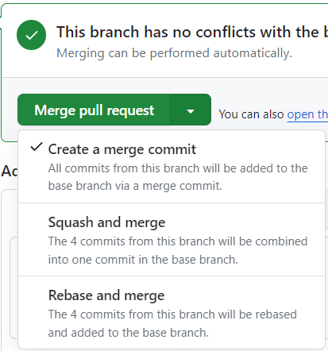

# git commit convention
---
제목은 코드 변경 사항에 대한 짧은 요약을 나타냅니다. 제목은 다음의 규칙을 지킵니다.

> 1. 제목의 처음은 동사 원형으로 시작합니다.  
> 2. 총 글자 수는 50자 이내로 작성합니다.  
> 3. 마지막에 특수문자는 삽입하지 않습니다. 예) 마침표(.), 느낌표(!), 물음표(?)  
> 4. 제목은 **개조식 구문**으로 작성합니다.

만약 영어로 작성하는 경우 다음의 규칙을 따릅니다. 

> 1. 첫 글자는 **대문자**로 작성합니다.  
> 2. "Fix", "Add", "Change"의 명령어로 시작합니다.

한글로 제목을 작성하는 경우 다음의 규칙을 따릅니다.

> 1. "고침", "추가", "변경"의 명령어로 시작합니다.

> 예시)  
> Feat: "추가 get data api 함수"

### 자주 사용하는 태그 종류

- **Feat** : 새로운 기능을 추가하는 경우
- **Fix** : 버그를 고친경우
- **Docs** : 문서를 수정한 경우
- **Style** : 코드 포맷 변경, 세미콜론 누락, 코드 수정이 없는경우
- **Refactor** : 코드 리펙토링
- **Test** : 테스트 코드 작성, 리팩토링, 오류 수정
- **Chore** : 빌드 업무 수정, 패키지 매니저 수정
- **Design** : CSS 등 사용자가 UI 디자인을 변경했을 때
- **Rename** : 파일명이나 폴더명을 수정하거나 옮기는 경우
- **Remove** : 코드나 파일을 삭제한 경우. "Clean", "Eliminate" 를 사용하기도 함
refactor 예:
1. 중복된 코드를 제거
2. 클래스를 분리
3. 함수의 인수를 재구성

 style 예:
1. 공백과 들여쓰기를 사용해 코드를 정리
2. 코드에 주석을 작성
3. 변수 이름을 명확하게 작성
### 기타 태그 타입들

- **Add** : 코드나 테스트, 예제, 문서등의 추가 생성이 있는경우
- **Improve** : 향상이 있는 경우. 호환성, 검증 기능, 접근성 등이 될수 있습니다.
- **Implement** : 코드가 추가된 정도보다 더 주목할만한 구현체를 완성시켰을 때
- **Move** : 코드의 이동이 있는경우
- **Updated** : 계정이나 버전 업데이트가 있을 때 사용. 주로 코드보다는 문서나, 리소스, 라이브러리등에 사용합니다.
- **Comment** : 필요한 주석 추가 및 변경
[참고1](https://velog.io/@msung99/Git-Commit-Message-Convension)
[참고2](https://overcome-the-limits.tistory.com/entry/%ED%98%91%EC%97%85-%ED%98%91%EC%97%85%EC%9D%84-%EC%9C%84%ED%95%9C-%EA%B8%B0%EB%B3%B8%EC%A0%81%EC%9D%B8-git-%EC%BB%A4%EB%B0%8B%EC%BB%A8%EB%B2%A4%EC%85%98-%EC%84%A4%EC%A0%95%ED%95%98%EA%B8%B0)

# 작업 브랜치 생성하기
```
git checkout -b ddolboghi
```
# git 브랜치 전략
---
## git flow
#### main
- 소프트웨어 제품을 배포하는 용도로 쓰는 브랜치
#### develop
- 개발용 브랜치
- 이 브랜치를 기준으로 feature브랜치를 따고 각 feature를 여기서 합침
#### feature
- 단위 기능 개발용 브랜치
#### release
- 다음 배포를 위해 기능에 문제가 없는지 QA하는 브랜치
#### hotfix
- 배포 후(master에 배포 코드가 합쳐진후) 버그 발생 시 긴급 수정하는 브랜치
#### 장점
- 안정적으로 버전별 배포 가능
#### 단점
- CI/CD에 적합하지 않음
- 웹 어플리케이션 개발에 적합하지 않음
  웹 어플리케이션은 하루에 몇번이고 릴리즈 될수 있으며 사용자는 항상 최신의 단일 버전만 사용하길 원하기 때문
---
## github flow
**브랜치 하나만 잘 관리하자**
hotfix브랜치 없음
#### main
- 항상 stable한 상태여야함
	- main의 모든 커밋은 언제 배포하든 문제 없어야함
	- 언제든 새로운 브랜치를 만들어도 문제 없어야함
#### topic
- git flow의 feature브랜치와 동일한 역할
- 새로운 기능을 개발할때 topic브랜치를 main브랜치로부터 생성
- 버그 수정도 여기서 함
#### 장점
- 소스코드가 한 곳에만 있어 관리 쉬움
#### 단점
- 테스트를 많이 자주해야함
- 테스트와 배포가 자동화된 시스템에 적합

개발팀이 소규모고 제품이 단일 릴리즈 버전 밖에 존재하지 않는다면 github flow가 적절함

일반적으로 웹 애플리케이션은 여러 버전을 관리하지 않고 가장 최신 버전 하나만을 사용자가 사용하므로 github flow는 웹 에플리케이션에 적합함

---
## 브랜치 작명
- main, develope는 그대로
- feature/기능요약 ex) feature/login
- 이슈 추적 시 feature/{issue-number}-{feature-name}
- release-1.xx
- hotfix-1.xx

---
> [!tip] gitignore 적용 안될때
> git의 캐시 문제 --> 캐시 삭제
>`git rm -r --cached .`
>`git add .`
>`git commit -m "fixed untracked files"`
# git 명령어
- 실무에서는 원격 저장소를 클론하는 방식 많이 사용
- 명령어 하나 입력하고 `git status`로 깃 상태가 어떻게 변하는지 파악하기
- vscode > source control > GUI graph로 깃 로그를 그래프로 볼 수 있음
## git revert & reset
`git revert {commit ID}` : 되돌아가고 싶은 커밋 ID를 입력해서 변경사항을 되돌리고, 되돌린 기록을 커밋으로 남김

|  | 로컬 변경 내용 | staging area |
| ---- | ---- | ---- |
| `git reset --soft {commit ID}` | 남아있음 | 남아있음(add되있음) |
| `git reset --mixed {commit ID}` | 남아있음 | 남아있음(add 안되있음) |
| `git reset --hard {commit ID}` | 되돌아감 | 없음(add 안되있음) |
- 현업에서는 원격저장소에 올라가 있는건 `git revert` 사용
> ⚠ 자신의 커밋 기록이 협업하는 브랜치로 올라간 상태이고, 해당 커밋을 되돌리려면 반드시 reset 대신 revert 를 사용해야 합니다. 

## git branch & merge
- `git switch`: 오직 브랜치 이동 및 생성을 위한 명령어, git 공식에서 권장
- `git checkout`: switch의 기능 뿐만아니라 특정 커밋 시점으로 되돌아가는데도 사용
- fast-forward merge: 주 브랜치의 헤드를 현재 브랜치와 동일한 커밋을 가리키도록 이동시킴
- 3-way merge: 각 브랜치의 마지막 커밋 2 개와 공통 조상의 마지막 커밋 총 3개의 커밋을 이용
	1. 내 브랜치 커밋
	2. 남의 브랜치 커밋
	3. 두 브랜치의 공통 조상이 되는 커밋
- squash and merge: merge하는 브랜치의 커밋들을 1개의 커밋으로 합쳐서 타겟 브랜치에 merge
	- merge된 브랜치의 커밋들이 남지 않아 변경사항을 읽기 수월함
	- 누가 어떤 커밋을 통해 어떤 라인을 수정했는지 알 수 없음
## git rebase
- rebase할 브랜치를 대상 브랜치 뒤에 옮겨 붙임
- merge와의 차이점: merge는 처음 브랜치가 생성된 커밋 시작 시점이 바뀌지 않지만, rebase는 주 브랜치에 rebase한 브랜치의 시작 시점이 주 브랜치의 최신 커밋 시점으로 이동됨 --> rebase하면 이전 커밋 기록에 주 브랜치 하나만 남음
> [!Tip]
> -  rebase를 할때 웬만하면 대상 브랜치는 dev나 main 같은 주요 브랜치가 되어야 합니다.
> - 회사 정책에따라 merge를 사용하거나, rebase를 사용합니다.

1. 분기된 커밋 시점부터 현재 브랜치까지의 변경사항을 모두 patch로 저장해둠
2. 대상 브랜치에 변경사항 적용하여 새로운 커밋으로 생성
3. rebase된 브랜치가 대상 브랜치의 최신 커밋 지점을 가리키도록 이동됨

- rebase된 브랜치의 변경사항들은 dangling상태가 되며, 가비지컬렉션 대상
### 충돌 시 해결 방법
1. 충돌한 파일 직접 코드 수정
2. `git rebase --continue`

rebase 전으로 되돌리고 싶으면 `git rebase --abort`

> [!info]
> github에 올려진 PR을 merge 또는 rebase 또는 squash and merge를 정합니다.
> 


## git reflog
- HEAD의 업데이트 기록 출력
- commit , reset , merge , rebase , checkout 등 HEAD의 이동이 필요한 모든 순간이 기
록되어있고, `git reset {해시값}` 명령을 통해서 해당 시점으로 돌아갈 수 있음
- `git reflog {브랜치 명}`: 특정 브랜치의 reflog를 볼 수 있음

## git cherry-pick {커밋hash}
- 원하는 특정 커밋을 선택하여 현재 브랜치에 적용

## git restore
- `git restore {파일이름 | .}`: 작업 디렉토리에서 파일을 수정했는데 이것을 되돌림
- `git restore --staged {파일이름 | .}`: staging 영역에 add한 파일을 staging 영역에서 꺼냄. 파일 변경 사항은 그대로
## git clean
- `git clean -n`: 삭제될 파일(스테이지 영역에 올라가지 않았고, 작업 디렉토리에 남아있는 새로운 파일) 리스트 출력
- `git clean -dn`: 폴더도 함께 출력
- `git clean -f`: 스테이지 영역에 올라가지 않았고, 작업 디렉토리에 남아있는 새로운 파일 삭제
- `git clean -df`: 폴더도 함께 삭제
## git fetch
- 원격 저장소의 현재 브랜치에 대한 커밋을 로컬로 가져오기만 함
- `git fetch --all`: 원격 저장소의 **모든 브랜치**에 대한 커밋을 가져옴
## git stash
- `git stash`: 변경사항들을 잠시 치워두고 새로운 기능을 개발할때 사용
- 변경사항들이 임시 저장공간에 저장되있다고 생각하면 됨
- `git stash save {저장할 이름}`: 저장할때 이름 지정
- `git stash list`: 저장된 stash들의 목록 확인
- `git stash apply`: 가장 최신의 stash만 가져와서 적용
- `git stash apply --index {번호}`: 번호에 해당하는 stash를 가져와 적용
- `git stash clear`: stash된 모든 항목 비움
# 오픈소스 기여 방법
1. 오픈소스 레포지토리 fork하기
2. 로컬에서 작업
3. 내가 fork한 레포지토리의 브랜치로 push
4. 원본 레포지토리로 PR
