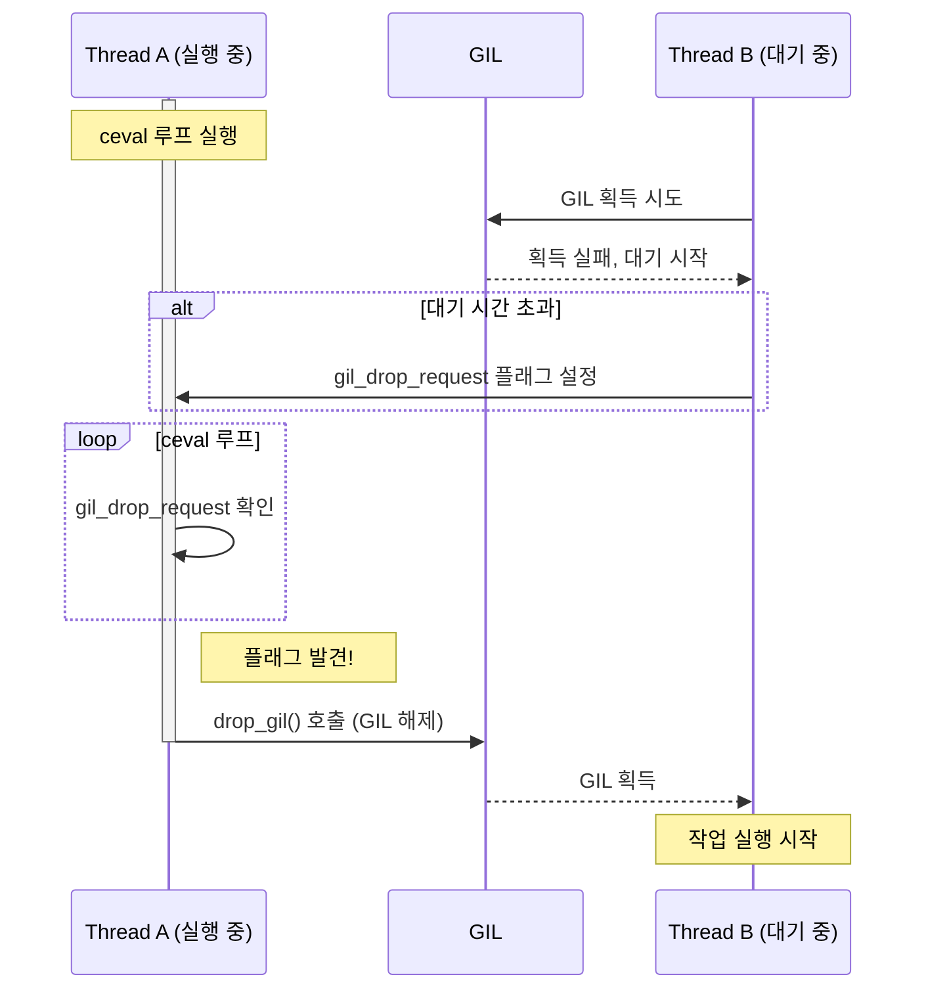
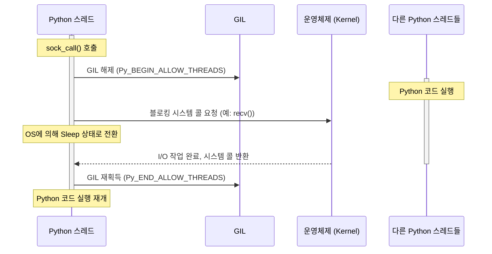
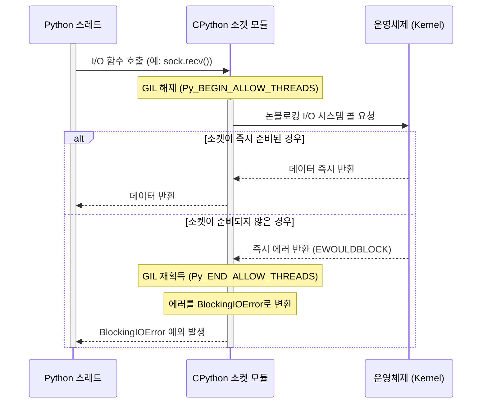
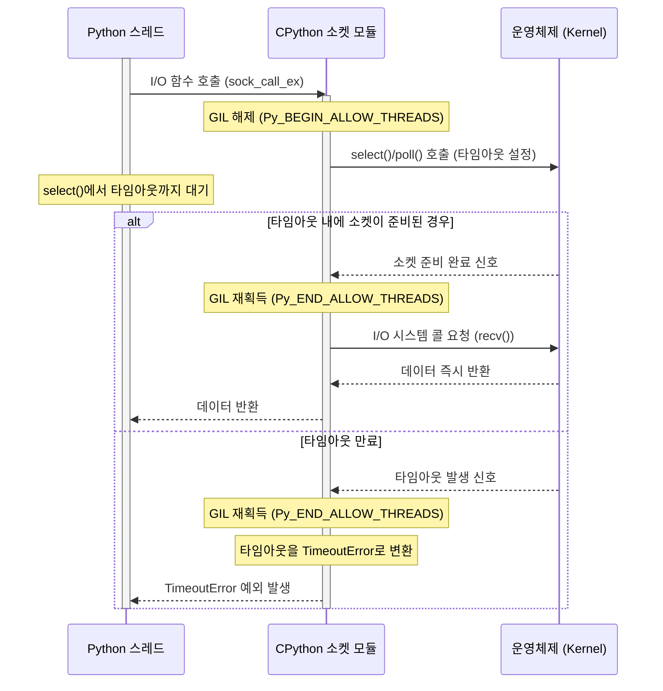

## GIL이란?
GIL은 Global Interpreter Lock으로, 여러 네이티브 스레드가 동시에 파이썬 바이트코드를 실행하는 것을 방지하는 뮤텍스(MUTual EXclusion, 상호배제)이다. GIL이 존재하는 주된 이유는 CPython의 메모리 관리 방식, 특히 참조 카운팅이 스레드에 안전하지 않기 때문이다.

`x += 1`과 같은 단순한 연산조차도 GIL 없이는 경쟁 조건(race condition)을 유발할 수 있다. 두 스레드가 동시에 객체의 참조 카운트를 읽고, 각자 1을 더한 후, 다시 값을 쓰는 과정에서 하나의 증가분이 유실되어 메모리 손상으로 이어질 수 있다.

## GIL 상태 구조체
GIL의 상태는 `Include/internal/pycore_gil.h`에 정의된 `_gil_runtime_state` 구조체를 통해 관리된다.
```C
#ifndef Py_INTERNAL_GIL_H
#define Py_INTERNAL_GIL_H
#ifdef __cplusplus
extern "C" {
#endif

#ifndef Py_BUILD_CORE
#  error "this header requires Py_BUILD_CORE define"
#endif

#include "pycore_condvar.h"       // PyCOND_T

#ifndef Py_HAVE_CONDVAR
#  error You need either a POSIX-compatible or a Windows system!
#endif

/* Enable if you want to force the switching of threads at least
   every `interval`. */
#undef FORCE_SWITCHING
#define FORCE_SWITCHING

struct _gil_runtime_state {
#ifdef Py_GIL_DISABLED
    /* If this GIL is disabled, enabled == 0.

       If this GIL is enabled transiently (most likely to initialize a module
       of unknown safety), enabled indicates the number of active transient
       requests.

       If this GIL is enabled permanently, enabled == INT_MAX.

       It must not be modified directly; use _PyEval_EnableGILTransiently(),
       _PyEval_EnableGILPermanently(), and _PyEval_DisableGIL()

       It is always read and written atomically, but a thread can assume its
       value will be stable as long as that thread is attached or knows that no
       other threads are attached (e.g., during a stop-the-world.). */
    int enabled;
#endif
    /* microseconds (the Python API uses seconds, though) */
    unsigned long interval;
    /* Last PyThreadState holding / having held the GIL. This helps us
       know whether anyone else was scheduled after we dropped the GIL. */
    PyThreadState* last_holder;
    /* Whether the GIL is already taken (-1 if uninitialized). This is
       atomic because it can be read without any lock taken in ceval.c. */
    int locked;
    /* Number of GIL switches since the beginning. */
    unsigned long switch_number;
    /* This condition variable allows one or several threads to wait
       until the GIL is released. In addition, the mutex also protects
       the above variables. */
    PyCOND_T cond;
    PyMUTEX_T mutex;
#ifdef FORCE_SWITCHING
    /* This condition variable helps the GIL-releasing thread wait for
       a GIL-awaiting thread to be scheduled and take the GIL. */
    PyCOND_T switch_cond;
    PyMUTEX_T switch_mutex;
#endif
};

#ifdef __cplusplus
}
#endif
#endif /* !Py_INTERNAL_GIL_H */
```
- GIL의 본체는 `locked`라는 변수 하나다. 이 변수가 1이면 GIL이 잠긴 상태다.
- 이 `locked` 변수에 여러 스레드가 동시에 접근해서 값을 바꾸는 것을 막기 위해 `gil_mutex`라는 뮤텍스로 보호한다. 이 뮤텍스는 아주 짧은 시간 동안만 사용되므로 스레드 간 경합이 거의 발생하지 않는다.
- GIL의 상태 변경(잠김 → 풀림)을 다른 스레드에게 알리기 위해 `gil_cond`라는 조건 변수를 사용한다.

`_gil_runtime_state` 구조체를 "노래방 마이크 시스템"이라고 생각할 수 있다.
- `locked`: 마이크가 사용 중인지 아닌지를 나타내는 'ON AIR' 불빛.
- `interval`: 한 사람이 마이크를 독점할 수 있는 시간.
- `mutex`: 마이크 상태(불빛, 예약자 명단)를 변경할 때 관리자만 만질 수 있도록 하는 잠금장치.
- `cond`: 다음 차례를 기다리는 사람들이 대기하는 의자. 마이크가 비면 관리자가 "다음 분 들어오세요!"라고 신호를 보내는 것과 같다.
- `last_holder`: 방금 노래를 마친 사람.

## 선점형 스레드 전환
CPython은 일종의 선점형 멀티태스킹을 구현한다. `ceval` 루프는 주기적으로 `gil_drop_request`라는 플래그를 확인한다. GIL을 기다리는 다른 스레드는 대기 시간이 초과하면 이 플래그를 설정한다. 현재 실행 중인 스레드는 이 플래그를 발견하면 자발적으로 `drop_gil()`을 호출하여 GIL을 해제한다. 이 메커니즘은 하나의 CPU 집약적 스레드가 인터프리터를 무한정 독점하는 것을 방지한다



## GIL 획득 및 해제
핵심 로직은  `Python/ceval_gil.c`에 구현되어 있다.
### take_gil
`take_gil(PyThreadState *tstate)`: 스레드가 GIL을 획득하는 로직을 구현한다. 이 함수는 `gil.mutex`를 획득하고 `gil.locked` 플래그를 확인하는 루프를 포함한다. 만약 잠겨 있다면, `gil.cond` 조건 변수에서 지정된 시간 동안 대기한다.

1. 뮤텍스 잠금: `MUTEX_LOCK(gil->mutex)`를 호출하여 GIL의 상태 변수들에 안전하게 접근할 준비를 한다.
2. GIL 상태 확인 루프: `while (_Py_atomic_load_int_relaxed(&gil->locked))` 루프에 진입한다. 즉, GIL이 다른 스레드에 의해 잠겨있는 동안(`locked == 1`) 이 루프 안에서 대기한다.
3. 조건부 대기 (Timed Wait): 루프 안에서 `COND_TIMED_WAIT`를 호출한다. 이 함수는 다음 세 가지 동작을 원자적으로 수행한다.
	- `gil->mutex`를 일시적으로 해제한다.
	- `gil->cond`라는 조건 변수를 `interval` 시간(기본 5000µs) 동안 기다린다. 다른 스레드가 GIL을 해제하면 이 조건 변수에 신호를 보내 이 스레드를 깨우게 된다.
	- 깨어나면(신호를 받거나 타임아웃되면) 다시 `gil->mutex`를 자동으로 잠그고 루프의 다음 조건 검사를 진행한다.

4. 양보 요청 (Drop Request): 만약 `COND_TIMED_WAIT`이 신호가 아닌 타임아웃으로 종료되었고, GIL이 여전히 잠겨있다면, 현재 GIL을 가진 스레드가 너무 오래 실행되고 있다고 판단한다. 이때 `_Py_set_eval_breaker_bit(holder_tstate, _PY_GIL_DROP_REQUEST_BIT)`를 호출하여 GIL을 점유한 스레드(`holder_tstate`)의 `eval_breaker`에 "GIL을 양보해달라"는 요청 비트를 설정한다.
5. GIL 획득: `while` 루프를 빠져나왔다는 것은 `gil->locked`가 0(해제됨)이 되었다는 의미다. 이때 스레드는 다음을 수행한다.
	- `_Py_atomic_store_int_relaxed(&gil->locked, 1)`: GIL을 잠근다.
	- `gil->last_holder`를 현재 스레드로 업데이트하고, 스레드 전환 횟수(`switch_number`)를 증가시킨다.
	- `tstate->holds_gil = 1`: 현재 스레드의 상태에 GIL을 보유하고 있음을 표시한다.

6. 뮤텍스 해제: `MUTEX_UNLOCK(gil->mutex)`를 호출하여 GIL 상태 변수 보호를 마친다.

### drop_gil
멀티코어에서는 GIL을 해제한 스레드 A가 코어 1에서 계속 실행 상태로 남아있을 수 있다. 이때 스레드 B가 코어 2에서 막 깨어나 GIL을 획득하려고 할 때, 코어 1의 스레드 A가 경쟁에서 이겨 GIL을 다시 가져가 버리는 문제가 발생할 수 있다. `drop_gil()`에서 공정성 보장 로직을 통해 이를 방지한다.

`drop_gil(PyThreadState *tstate)`: GIL을 해제하는 함수다. `gil.mutex`를 획득하고 `gil.locked`를 0으로 설정한 뒤, `gil.cond`에 신호를 보내 대기 중인 스레드 중 하나를 깨운다.

1. 마지막 소유자 기록: `_Py_atomic_store_ptr_relaxed(&gil->last_holder, tstate)`를 통해 "내가 마지막으로 GIL을 가졌었다"고 기록을 남긴다.
2. 핵심 해제 로직 (`drop_gil_impl`):
	- `MUTEX_LOCK(gil->mutex)`: GIL 상태 변수를 안전하게 수정하기 위해 뮤텍스를 잠근다.
	- `_Py_atomic_store_int_relaxed(&gil->locked, 0)`: GIL을 해제하는 가장 핵심적인 부분으로, `locked` 상태를 0으로 바꾼다.
	- `tstate->holds_gil = 0`: 현재 스레드의 상태에 GIL을 더 이상 보유하지 않음을 표시한다.
	- `COND_SIGNAL(gil->cond)`: `take_gil()`에서 대기 중인 다른 스레드 중 하나를 깨워 GIL을 획득할 기회를 준다.
	- `MUTEX_UNLOCK(gil->mutex)`: 뮤텍스를 해제한다.

3. 공정성 보장 로직 (`FORCE_SWITCHING`):
	- 만약 이 GIL 해제가 다른 스레드의 양보 요청(`_PY_GIL_DROP_REQUEST_BIT`) 때문에 발생했다면, 이 스레드는 자신이 GIL을 놓자마자 바로 다시 획득하는 불공정한 상황을 막아야 한다.
	- 이를 위해 `gil->last_holder`가 자신에서 다른 스레드로 바뀔 때까지, 즉 다른 스레드가 GIL을 성공적으로 획득한 것을 확인할 때까지 `COND_WAIT(gil->switch_cond, gil->switch_mutex)`를 통해 잠시 대기한다.
	- 다른 스레드가 `take_gil()`에 성공하면 `switch_cond`에 신호를 보내 대기 중인 이 스레드를 깨워준다.

## GIL의 동시성 병목 현상
GIL이 멀티코어 CPU 환경에서 문제가 되는 이유는 명확하다. 한 번에 하나의 스레드만 파이썬 바이트코드를 실행할 수 있으므로, 듀얼 코어 머신에서 두 개의 CPU 집약적 스레드를 실행하더라도 특정 순간에는 오직 하나의 코어만이 파이썬 코드를 처리할 수 있다. 다른 코어는 파이썬 실행 관점에서는 유휴 상태로 남게 되며, 스레드들은 GIL을 얻기 위해 문맥 교환(context switching)을 반복하게 된다. 이로 인한 오버헤드 때문에 오히려 단일 스레드 버전보다 성능이 저하되는 경우가 많다.  

이러한 GIL의 동작 방식은 파이썬 개발자가 동시성을 단일 개념이 아닌 두 개의 근본적으로 다른 모델로 생각하게 만든다. 첫 번째는 'I/O 집약적 동시성'으로, 대기 중에 GIL이 협조적으로 해제되므로 `threading` 모듈과 잘 작동한다. 두 번째는 'CPU 집약적 병렬성'으로, `threading` 모듈에 의해 오히려 방해받으며 `multiprocessing`과 같은 완전히 다른 아키텍처를 필요로 한다.

CPython의 표준 라이브러리는 잠재적으로 블로킹(blocking)될 수 있는 시스템 콜을 호출하기 직전에 GIL을 해제하도록 설계되었다.

### socket 모듈
이 원리를 가장 잘 보여주는 예는 `socket` 모듈의 C 구현이다.

- 파이썬의 `socket` 메서드(예: `sock_connect`, `sock_send`, `sock_recv`)를 구현하는 C 함수들은 실제 블로킹 시스템 콜을 `sock_call_ex()`함수에서 소켓이 준비되면, `sock_func()`를 `Py_BEGIN_ALLOW_THREADS`와 `Py_END_ALLOW_THREADS` 매크로 쌍으로 감싸서 호출한다.
	```C
	while (1) {
	    Py_BEGIN_ALLOW_THREADS
	    res = sock_func(s, data);
	    Py_END_ALLOW_THREADS
	```

- `Py_BEGIN_ALLOW_THREADS` 매크로는 `PyEval_SaveThread()` 함수로 확장된다. 이 함수는 현재 스레드의 상태를 저장하고 `drop_gil()`을 호출하여 GIL을 해제한다. 이를 통해 다른 파이썬 스레드가 깨어나 GIL을 획득하고 CPU에서 실행될 수 있다.
- `Py_END_ALLOW_THREADS` 매크로는 `PyEval_RestoreThread()` 함수로 확장되며, 이 함수는 `take_gil()`을 호출하여 잠금을 다시 획득한 후 파이썬 코드로 복귀한다.

이 메커니즘 덕분에 여러 I/O 집약적 스레드가 동시에 "대기" 상태에 있을 수 있다. 총 대기 시간이 중첩되므로 상당한 성능 향상을 가져온다. 비록 특정 순간에는 단 하나의 스레드만이 파이썬 코드를 실행하지만, 프로그램은 마치 병렬로 실행되는 것처럼 보인다.
- Blocking I/O: 스레드는 개별 I/O 작업(`recv()`, `send()`) 에서 블로킹된다. 소켓 하나를 기다리는 동안 다른 일은 전혀 할 수 없다.
- Non-blocking I/O (+ Multiplexing): 스레드는 `select()`나 `poll()` 같은 시스템 호출과 여러 I/O 이벤트를 기다리는 단일 지점(`select()`, `poll()`) 에서만 블로킹된다. 이를 통해 단일 스레드로 수많은 소켓의 I/O를 효율적으로 동시에 처리할 수 있다. `asyncio`와 같은 비동기 라이브러리들이 바로 이 원리를 사용한다.

### 스레드가 blocking되는 상황
스레드가 블로킹되는 경우는 소켓에 타임아웃이 설정되어 있지 않을 때 (`socket.settimeout(None)` 또는 `socket.setblocking(True)`) 다.

`sock_call()` 함수는 내부적으로 `sock_call_ex()`를 호출한다. 이때 넘겨준 timeout 값이 음수이므로 `internal_select()`를 통한 사전 상태 확인 없이 바로 I/O 시스템 콜(예: `recv()`, `send()`, `accept()`)을 실행한다.

동작 원리:
1. `sock_call()`이 호출되면, GIL을 해제하는 `Py_BEGIN_ALLOW_THREADS` 매크로가 실행된다.
2. 이후 운영체제의 `recv()`나 `send()` 같은 블로킹 함수가 직접 호출된다.
3. 이 시스템 콜은 데이터를 모두 받거나 보낼 때까지, 또는 연결이 끊어지는 등의 이벤트가 발생할 때까지 반환되지 않는다. 이 시간 동안 해당 스레드는 운영체제에 의해 대기(sleep) 상태가 된다.
4. 작업이 완료되면 시스템 콜이 반환되고, `Py_END_ALLOW_THREADS` 매크로를 통해 스레드는 다시 GIL을 획득하여 작업을 이어간다.



### 스레드가 Non-blocking되는 상황
스레드가 논블로킹되는 경우는 소켓에 타임아웃이 0 또는 양수로 설정되었을 때다. 이 경우 소켓의 파일 디스크립터(FD)는 `internal_setblocking(s, 0)`을 통해 논블로킹 모드로 설정된다.

상황 1: `socket.settimeout(0)` 또는 `socket.setblocking(False)`:
1. I/O 함수가 호출되면, 데이터를 즉시 처리할 수 있는지 딱 한 번만 확인한다.
2. 만약 읽을 데이터가 없거나, 보낼 버퍼가 꽉 차 있다면, 시스템 콜은 대기하지 않고 즉시 `-1`을 반환하며 에러 코드(주로 `EWOULDBLOCK` 또는 `EAGAIN`)를 설정한다.
3. CPython은 이 에러를 `BlockingIOError` 예외로 변환하여 발생시킨다. 스레드는 전혀 대기하지 않는다.



  

상황 2: `socket.settimeout(float > 0)`
- `sock_call_ex()` 함수가 핵심적인 역할을 한다.

1. `sock_call_ex()`는 실제 I/O를 시도하기 전에 먼저 `internal_select()` 함수를 호출한다. (`internal_select`는 내부적으로 `poll()` 또는 `select()` 시스템 콜을 사용한다.)
2. `internal_select()`는 지정된 타임아웃 시간 동안 소켓이 읽기 또는 쓰기 가능한 상태가 될 때까지 스레드를 블로킹한다. 즉, 대기는 I/O 작업 자체가 아닌 `select()`/`poll()`에서 발생한다.
3. 만약 타임아웃 시간 내에 소켓이 준비되면, `internal_select()`가 반환되고 실제 I/O 시스템 콜 (`recv()`, `send()`)이 호출된다. 이때는 이미 데이터가 준비된 상태이므로 작업이 즉시 완료될 가능성이 높다.
4. 만약 타임아웃이 만료될 때까지 소켓이 준비되지 않으면, `internal_select()`는 타임아웃을 알리고 `sock_call_ex()`는 `TimeoutError` 예외를 발생시킨다.

요약하자면, 타임아웃이 설정된 소켓은 논블로킹 모드로 동작하지만, `select()`나 `poll()`을 통해 제한된 시간 동안만 블로킹되며, 이를 통해 타임아웃 기능을 구현하고 스레드가 무한정 대기하는 것을 방지한다.



CPython의 소켓은 기본적으로 블로킹(blocking) 네트워크 I/O 방식으로 동작한다.
`socket` 모듈이 처음 임포트될 때 실행되는 `socket_exec` 함수에서 모듈 전체에 적용될 기본 타임아웃(`defaulttimeout`)을 -1로 설정한다.
```C
// in socket_exec()
static int
socket_exec(PyObject *m)
{
    // ... (생략) ...
    socket_state *state = get_module_state(m);

    // defaulttimeout을 -1초를 의미하는 PyTime_t 값으로 초기화
    _Py_atomic_store_int64_relaxed(&state->defaulttimeout, _PYTIME_FROMSECONDS(-1));
    // ... (생략) ...
}
```

`socket()`을 호출하여 새 객체를 만들면 `init_sockobject` 함수가 호출된다. 이 함수는 위에서 설정한 모듈의 기본 타임아웃 값을 새로 만든 객체의 `sock_timeout` 멤버 변수에 복사한다.
```C
// in init_sockobject()
static int
init_sockobject(socket_state *state, PySocketSockObject *s,
                SOCKET_T fd, int family, int type, int proto)
{
    // ... (생략) ...
#ifdef SOCK_NONBLOCK
    if (type & SOCK_NONBLOCK)
        s->sock_timeout = 0;
    else
#endif
    {
        // 모듈의 defaulttimeout 값을 소켓 객체의 sock_timeout으로 설정
        s->sock_timeout = _Py_atomic_load_int64_relaxed(&state->defaulttimeout);
        if (s->sock_timeout >= 0) {
            // 만약 타임아웃이 양수이면 논블로킹 모드로 설정
            if (internal_setblocking(s, 0) == -1) {
                return -1;
            }
        }
    }
    // ... (생략) ...
    return 0;
}
```

따라서 Non-blocking 방식으로 동작시키려면 개발자가 `settimeout()`이나 `setblocking()` 같은 메서드로 따로 설정을 변경해야 한다.
asyncio의 SelectorEventLoop 클래스 중 소켓으로부터 데이터를 받는 메서드를 보면, 실제로 non-blocking으로 sock.recv()가 동작하도록 보장한다.
```Python
async def sock_recv(self, sock, n):
    base_events._check_ssl_socket(sock)
    if self._debug and sock.gettimeout() != 0:
        raise ValueError("the socket must be non-blocking")
    try:
        return sock.recv(n)
    except (BlockingIOError, InterruptedError):
        pass
    #...        
```

## CPython의 멀티 스레딩 동작 원리
현대 운영체제(Windows, Linux, macOS 등)는 커널 스레드를 직접 지원하며, CPython의 스레드는 이 커널 스레드에 일대일로 매핑된다. 즉, 파이썬에서 스레드를 하나 생성하면, 운영체제도 이에 대응하는 커널 스레드를 하나 생성한다.

CPython 멀티 스레딩 프로그램을 실행할 때 운영체제는 다음과 같이 동작한다.
1. 커널 스레드 생성
	- 파이썬 프로그램이 스레드를 생성하면, 내부적으로 운영체제의 시스템 호출(Linux의 `clone()`, Windows의 `CreateThread()`)이 일어나 커널 스레드가 생성된다. 운영체제는 이 커널 스레드를 독립적인 실행 단위로 인식한다.

2. 스케줄링
	- 운영체제의 CPU 스케줄러는 CPython의 GIL 존재를 모른다.
	- 스케줄러는 시스템에 존재하는 모든 커널 스레드들을 대상으로 스케줄링을 수행한다. 즉, 스케줄러의 관점에서는 CPython 프로그램의 스레드들이나 다른 어떤 프로그램의 스레드들이나 동등한 경쟁 대상이다.
	- 멀티코어 시스템이라면, 스케줄러는 여러 개의 커널 스레드를 각기 다른 CPU 코어에 동시에 할당하여 병렬로 실행시킬 수 있다.
3. 컨텍스트 스위칭 (Context Switching)
	- 스케줄러는 정해진 시간 할당량(Time Quantum)이 끝나거나, 스레드가 I/O 작업으로 인해 대기 상태에 들어가거나, 더 높은 우선순위의 스레드가 나타나면 컨텍스트 스위치를 수행한다.
	- 이때 스레드의 레지스터 값, 프로그램 카운터, 스택 포인터 등 실행 문맥 정보가 해당 스레드의 PCB(Process Control Block) 또는 TCB(Thread Control Block)에 저장된다. 이 과정은 GIL과 무관하게 순수하게 운영체제 수준에서 일어난다.  

결론적으로, CPython 프로그램이 I/O 바운드 작업을 수행할 때 멀티 스레딩은 효과적이다.

특정 스레드가 I/O를 기다리며 블로킹되면, CPython의 GIL은 해제되고, 운영체제는 해당 커널 스레드를 대기 상태로 전환한다. 동시에 운영체제 스케줄러는 다른 스레드를 다른 CPU 코어에서 실행시킬 수 있다. 이 스레드가 파이썬 코드를 실행하기 위해 GIL을 획득하면 된다.

이처럼 운영체제는 GIL의 존재와 상관없이 독립적으로 커널 스레드를 스케줄링하여 멀티 스레딩의 이점(특히 I/O 작업에서의 동시성)을 살려준다. 하지만 CPU 바운드 작업에서는 GIL 때문에 여러 스레드가 동시에 파이썬 코드를 실행하지 못해 성능 향상을 기대하기 어렵다.