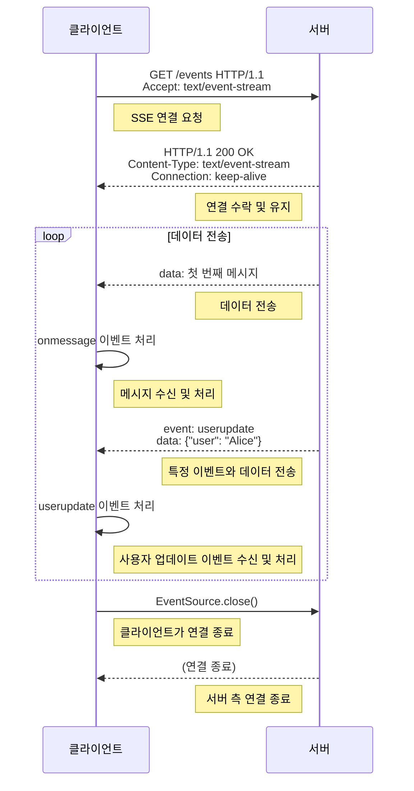

# 특징
- Server-sent events는 클라이언트가 HTTP 연결을 통해 서버로부터 데이터를 수신할 수 있도록 하는 서버 푸시 기술이다.
- 단방향 통신으로, 서버에서 클라이언트로만 데이터를 전송할 수 있다.
- HTTP 기반이므로 새로운 프로토콜을 구현할 필요 없고 WebSocket보다 가볍고 구현이 간단하다.
- 네트워크 오류로 연결이 끊기면 클라이언트가 자동으로 재연결을 시도하는 표준 메커니즘이 내장되있다.
- 서버는 특정 이벤트 유형을 지정하여 데이터를 전송할 수 있다.
- JavaScript의 EventSource API로 구현할 수 있다.
# 동작 과정
