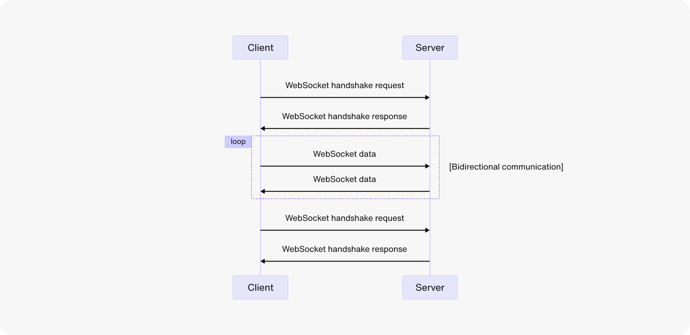
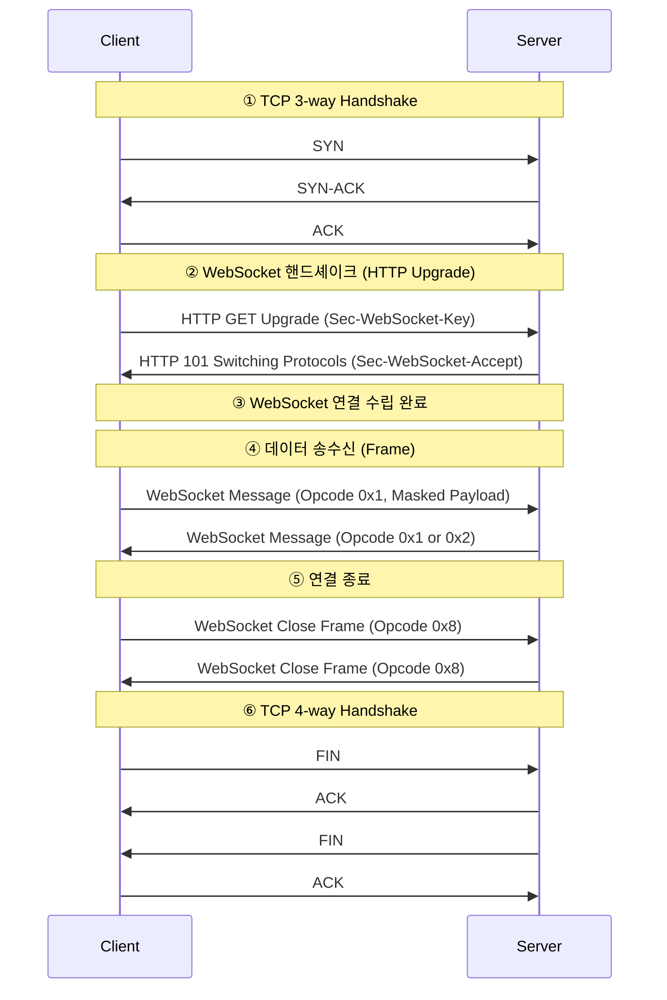
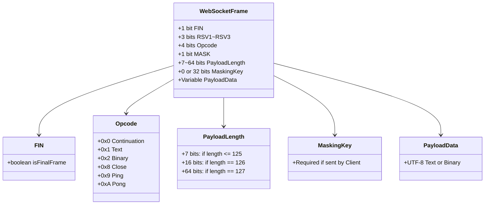

# 특징
- WebSocket 프로토콜은 클라이언트와 서버가 전이중 채널에서 통신하는 방식이다.
- HTTP 폴링보다 오버헤드가 적어 실시간 애플리케이션에 적합하다.
- WebSocket은 클라이언트와 서버의 지속적인 연결 덕분에 상태를 저장할 수 있다. 이는 개발자가 WebSocket 연결을 사용하는 방식에 달려있다.
- WebSocket 메시지는 자주 변경되기 때문에 캐싱하기 불리하다.

# 동작 과정

기본적으로 HTTP 기반으로 handshake를 시작한 후, TCP 기반의 지속 연결을 유지하여 실시간 통신이 가능하도록 한다.

## 1. 클라이언트에서 서버로 WebSocket 연결
먼저 TCP 3-way handshake를 수행한 뒤, 
클라이언트가 HTTP GET 요청을 WebSocket 전환 요청으로 보낸다.
### 요청 헤더:
```
GET /chat HTTP/1.1
Host: localhost:8080 
Upgrade: websocket 
Connection: Upgrade 
Sec-WebSocket-Key: x3JJHMbDL1EzLkh9GBhXDw== 
Sec-WebSocket-Protocol: chat, superchat 
Sec-WebSocket-Version: 13
```
#### GET /chat HTTP/1.1
websocket 통신 요청을 위해서는 HTTP 1.1 이상, GET Method를 사용해야 한다.
#### Upgrade
프로토콜을 전환하기 위해 사용하는 헤더다.
websocket 접속 요청시 'websocket'이라는 값을 가진다.
다른 값이거나 값이 없다면 cross-protocol attack으로 간주하여 WebSocket 접속을 중지시킨다.
#### Connection
현재 전송이 완료된 후 접속을 유지할지 정하는 헤더다.
WebSocket 요청 시 반드시 'Upgrade'라는 값을 가진다.
다른 값이거나 값이 없다면 접속이 중지된다.
#### Sec-WebSocket-Key
유효한 요청인지 확인하기 위해 사용하는 키 값
#### Sec-WebSocket-Protocol
사용할 WebSocket 프로토콜을 하나 이상 지정한다. 이 헤더는 필요한 경우에만 사용한다.
#### Sec-WebSocket-Version
클라이언트가 사용하고자 하는 WebSocket 프로토콜 버전
### 응답 헤더:
```
HTTP/1.1 101 Switching Protocols
Upgrade: websocket
Connection: Upgrade
Sec-WebSocket-Accept: HSmrc0sMlYUkAGmm5OPpG2HaGWk=
Sec-WebSocket-Protocol: chat
```
#### HTTP/1.1 101 Switching Protocols
101은 HTTP에서 WS로 프로토콜 전환이 승인되었다는 응답 코드다.
#### Sec-WebSocket-Accept
요청 헤더의 Sec-WebSocket-Key에 고유 아이디를 더해서 sha-1로 해싱한 후, base64로 인코딩한 값이다.
WebSocket 연결이 개시되었음을 알린다.

## 2. 데이터 이동
데이터는 메시지라는 단위로 전달된다.
메시지는 여러 프레임으로 구성된다.
이 프레임은 데이터 링크계층(ethernet)에서 주고 받는 가장 작은 단위를 의미한다.
### 데이터 프레임 구조:



| 필드                 | 설명                        |
| ------------------ | ------------------------- |
| **FIN**            | 마지막 프레임 여부 (1이면 메시지 종료)   |
| **Opcode**         | 프레임 타입 지정 (텍스트, 종료 등)     |
| **MASK**           | 클라이언트 → 서버는 항상 1 (마스킹 필수) |
| **Payload Length** | 데이터 길이 (동적 크기)            |
| **Masking Key**    | 4바이트 키 (클라이언트 전송 시 필수)    |
| **Payload Data**   | 실제 메시지 (텍스트 또는 바이너리)      |
## 3. 연결 종료
### 정상 종료
1. 한쪽에서 Close 프레임을 전송한다. 이때 Opcode는 `0x8`이다.
2. 상대방은 이를 수신하고 응답 프레임으로 종료를 승인한다.
### 비정상 종료
네트워크 문제, 서버 다운 등으로 연결이 비정상적으로 끊어질 수 있는데, 이때 클라이언트는 `onclose`또는 `onerror`이벤트로 감지할 수 있다.

# 보안
## `wss://` 사용
- `ws://`는 평문 통신으로 중간자 공격에 취약하다.
- `wss://`는 HTTPS처럼 TLS 암호화 채널 위에 WebSocket을 얹는 방식이다.
- 서버가 공인 TSL 인증서를 적용한 도메인에서 HTTPS 서비스를 하고 있다면 클라이언트는 `wss://`를 사용할 수 있다.

## 메시지 무결성 및 인증
- 메시지 단위 서명 (HMAC, JWT) 활용
- 메시지를 주고받을때 Nonce/타임스탬프를 포함하여 재전송 공격 방지
- 