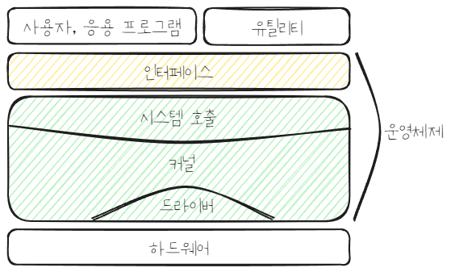

# 운영체제란?
> [!info] 운영체제의 정의
> 사용자에게 편리한 인터페이스 환경을 제공하고 컴퓨터 시스템의 자원을 효율적으로 관리하는 소프트웨어
- 운영체제는 소프트웨어와 하드웨어의 결합 형태인 펌웨어(firmware)라고 부르기도 함
- 컴퓨터는 운영체제 없어도 작동하지만 기능에 제약이 있음
- 운영체제가 있는 기계는 다양한 응용 프로그램을 설치해 사용할 수 있고 성능향상을 위한 기능을 쉽게 추가할 수 있지만, 운영체제가 없는 기계는 그러기 어려움
- 운영체제는 사용자가 직접 자원에 접근하는 것을 막아 컴퓨터 자원을 보호함
- 사용자는 운영체제가 제공하는 사용자 인터페이스와 하드웨어 인터페이스를 이용해 자원에 접근함
# 운영체제의 구조

## 커널과 인터페이스
- 커널: 프로세스 관리, 메모리 관리, 저장장치 관리 같은 핵심 기능 담당
- 인터페이스: 커널에 명령을 전달하고 실행 결과를 사용자와 응용 프로그램에 돌려줌
- 운영체제는 커널과 인터페이스를 분리 --> 같은 커널을 사용해도 다른 인터페이스를 가진 형태로 제작 가능
	- e.g. 유닉스의 기본 사용자 인터페이스는 명령어 기반의 shell이나, Mac OS도 유닉스 계열의 커널 기반임
- 커널의 핵심 기능
	- 프로세스 관리: 프로세스에 CPU를 배분하고 작업에 필요한 제반 환경 제공
	- 메모리 관리: 프로세스에 작업 공간 배치, 실제 메모리보다 큰 가상공간 제공
	- 파일 시스템 관리: 데이터를 저장하고 접근할 수 있는 인터페이스 제공
	- 입출력 관리
	- 프로세스 간 통신 관리: 공동 작업을 위한 프로세스 간 통신 환경 지원
### 시스템 호출(system call)
- 커널이 사용자나 응용 프로그램으로부터 컴퓨터 자원을 보호하기 위해 만든 인터페이스로, 시스템 자원의 사용과 연관된 함수 제공
- 컴퓨터 자원에 직접 접근하면 사용자나 응용 프로그램이 모든것을 처리해야하지만, 시스템 호출로 접근하면 커널이 작업을 전담해 요청의 결과만 받아볼 수 있음
- 운영체제는 커널이 제공하는 서비스를 시스템 호출로 제한하며, 사용자나 응용 프로그램이 커널 영역에 진입할 수 있는 유일한 수단임
> [!info] API vs SDK
> - API(Application Programming Interface): 운영체제의 API는 시스템 호출임
> - SDK(System Developer's Kit): 개발자를 위한 개발 도구 모음
### 드라이버
- 커널와 하드웨어의 인터페이스
- 하드웨어의 제작자가 만든 소프트웨어이며, 커널이 실행될때 함께 실행됨
- 키보드나 마우스처럼 간단한 하드웨어의 드라이버는 커널이 제공하지만, 크고 복잡한 디바이스 드라이버는 직접 설치해줘야 함
### 커널의 구성
#### 단일형 구조(monolithic architecture) 커널
- 초창기 운영체제 구조(MS-DOS, VMS, 초기 유닉스)
- 커널의 핵심 기능을 구현하는 모듈들이 하나로 구성됨
- 장점
	- 모듈 간 통신 비용이 매우 작아 효율적인 운영 가능
- 단점
	- 디버깅 어려움
	- 상호 의존성이 높아 기능상의 작은 결함이 시스템 전체로 확산
	- 수정이 어려워 다양한 환경의 시스템에 적용하기 어려움
#### 계층형 구조(layered architecture) 커널
- 비슷한 기능을 가진 모듈을 묶어 하나의 계층으로 만듬
- 계층간 통신으로 운영체제 구현
- 오류 발생한 계층만 수정하면 되서 디버깅 쉬움
- 현대 운영체제는 대부분 계층형 구조 커널임
#### 마이크로 구조(micro architecture) 커널
- 커널의 핵심 기능 모듈은 사용자 영역에서 제공하고, 커널 영역에서 프로세스 간 통신 모듈을 통해 모듈간 정보 교환
- 커널은 메모리 관리(메모리 관리자)와 프로세스 간 동기화 서비스(동기화 모듈) 제공하며, 이들은 프로세스 간 통신 모듈로 연결됨
- 각 모듈이 독립적으로 작동하므로 하나의 모듈이 실패해도 전체 운영체제는 안 멈춤
- 많은 컴퓨터에 이식하기 쉬움 
- 커널이 가벼워 CPU 용량이 작은 시스템에도 적용 가능
- e.g. 마이크로 구조 커널을 사용하는 운영체제인 Mach는 애플의 OS X와 iOS의 커널로 사용됨
## 가상머신
- 어떤 언어로 만든 프로그램이 다른 운영체제에서 작동하지 않는 경우를 해결하기 위해 가상머신 도입
- 가상머신은 운영체제와 응용 프로그램 사이에서 작동하는 프로그램
- 가상머신을 설치하면 응용 프로그램이 모두 동일한 환경에서 작동하는 것처럼 보임
- Java는 Java Virtual Machine(JVM)으로 유닉스와 윈도우에서 동일한 코드로 작동 가능
- 한 컴퓨터에 두 종류의 운영체제를 사용하고 싶을때, 주로 사용하지 않는 운영체제는 다른 운영체제에 가상머신을 설치해 사용 가능
- 가상머신을 사용하면 호환성이 높지만, 응용 프로그램이 가상머신을 통해서만 작동해 느림
# 부팅
- 컴퓨터를 켰을때 운영체제를 메모리에 올리는 과정
1. 롬에 저장된 바이오스 실행
2. 바이오스가 CPU, 메모리, 주변장치가 제대로 작동하는지 점검
3. 이상이 없으면 하드디스크의 마스터 부트 레코드에 저장된 부트스트랩을 메모리로 가져와 실행
	- 부트스트랩: 운영체제를 메모리로 가져와 실행하는 작은 프로그램
# 가상 메모리

- 프로그램이 실행되면 해당 프로그램의 프로세스가 가상 메모리에 적재됩니다.
- 가상 메모리의 상위 주소에 스택 영역이 있습니다.
- 하위 주소로 갈수록 힙 영역, 데이터 영역, 코드 영역(code segment)이 있습니다.
- c언어의 malloc 함수는 힙 영역에서 메모리를 할당받습니다.
- 데이터 영역과 코드 영역에는 실행 파일의 내용이 있습니다.
- 운영체제는 프로그램에 가상 메모리를 부여합니다.
- **모든 프로세스의 가상 메모리는 표준화되어있고, 영역이 배치되는 순서는 동일합니다.**
- 실제 메모리에서는 프로세스의 구성 요소들의 주소가 산파되어 있습니다.
- 링커가 실행 파일을 생성하자마자 실행 시 symbol의 메모리 주소를 결정할 수 있는 이유는, 프로그램의 실행여부와 관계없이 프로세스 메모리 구조를 알고 있기 때문입니다.
- 가상 메모리 주소는 실제 물리 메모리 주소와 매핑되며, 메모리 페이지 단위로 관리됩니다.
- 모든 메모리 주소가 매핑되진 않습니다.
- 페이지 테이블은 매핑 관계를 기록한 표입니다.
- **모든 프로세스는 자신만의 페이지 테이블이 있고**, CPU가 프로그램의 시작 가상 메모리 주소에 접근하면 하드웨어가 페이지 테이블을 참조하여 물리 메모리 주소로 변환한 후 접근합니다.
- **실제 물리 메모리의 크기는 가상 메모리의 크기와 무관합니다.**

# 동기와 비동기
- 비동기 호출은 주 스레드에서 호출한 스레드의 작업이 끝날때까지 기다리지 않고 자신의 작업을 이어나갈 수 있습니다. 비동기 호출은 2가지 경우가 있습니다.
	1. 호출자가 실행 결과를 전혀 신경쓰지 않을때
	2. 호출자가 실행 결과를 반드시 알아야 할때
- 1의 경우 주 스레드에서 콜백함수를  호출되는 함수에 매개변수로 넘겨줍니다. 이 콜백함수에는 호출되는 스레드의 작업 후 실행할 작업들이 담겨있습니다. 콜백함수는 호출되는 스레드에서 실행됩니다. 호출되는 스레드에 콜백함수의 내용을 직접 구현하지 않는 이유는, 유지보수성이 떨어지기 때문입니다.
- 2의 경우 호출되는 스레드가 작업을 완료하면 주 스레드에 알림을 보내고, 주 스레드가 결과를 처리합니다.
# blocking과 non-blocking
- blocking은 주로 함수 호출로 인해 호출자의 스레드나 프로세스가 운영체제에 의해 일시 중지되는 것입니다.
- 주 스레드가 non-blocking 함수를 실행하는 스레드의 작업을 빈번하게 추적하는 작업을 하면서 다른 작업을 하지 못한다면, 동기 호출로 볼 수 있습니다.
	- 이 경우 cpu 리소스가 쓸데없이 소모될 수 있습니다.
	- 예를 들어, 네트워크 데이터 수신 함수를 non-blocking으로 호출하고, 데이터를 수신했는지 확인하는 함수를 주 스레드에서 반복문으로 실행한 다음에 데이터 처리 함수를 호출하면 이 상황은 동기입니다.
- 모든 동기 호출이 blocking은 아니지만, 모든 blocking 호출은 동기 호출입니다.
# 다중 프로세스
- 가장 간단한 형태의 병행 처리 방식입니다.
- 리눅스에서 fork 방식을 이용해 부모 프로세스가 여러 자식 프로세스를 생성할 수 있습니다.
	- 부모 프로세스가 사용자 요청을 먼저 수신하고, 자식 프로세스를 생성해서 해당 사용자 요청을 처리하도록 합니다.
	- 모든 요청에는 각각 대응하는 프로세스(process-per-connection)가 있습니다.
- 장점:
	- 프로그래밍이 간단하여 이해하기 쉽습니다.
	- 개별 프로세스의 주소 공간은 격리되있어 하나의 프로세스에 문제가 발생하여 강제 종료되라도 다른 프로세스에는 영향을 미치지 않습니다.
	- 다중 코어 리소스를 최대한 활용할 수 있습니다.
- 단점:
	- 각 프로세스의 주소 공간이 격리되있기 때문에 프로세스의 통신 작동 방식을 사용해 프로세스 간 통신합니다.
	- 프로세스 생성 부담이 상대적으로 크고, 프로세스의 빈번한 생성과 종료는 시스템 부담을 증가시킵니다.
# 다중 스레드
- 각 요청에 대응하는 스레드(thread-per-connection)를 생성할 수 있습니다.
- 장정:
	- 스레드는 프로세스 주소공간을 공유하기 때문에 스레드 안전이 보장된다면 스레드간 별도의 통신 없이 직접 메모리를 읽어서 데이터를 얻을 수 있습니다.
	- 스레드 중 일부가 bloking되어도 다른 스레드에는 영향을 미치지 않습니다.
- 단점:
	- 같은 주소 공간을 공유하기 때문에 한 스레드에 문제가 발생해 강제 종료되면 같은 프로세를 공유하는 모든 스레드와 프로세스가 한꺼번에 강제 종료됩니다.
	- 여러 스레드가 동시에 공유 리소스의 데이터를 읽고 쓸때 스레드 안전 문제가 발생하지 않도록 해야합니다.
	- 초당 수만~수십만개의 요청을 처리해야하는 높은 동시성을 가진 서버에서 스레드를 수만 개 이상 생성하면 과도한 메모리 소비나 스레드 전환시 성능 손실이 발생할 수 있습니다.
# 이벤트 기반 프로그래밍
- 이벤트 기반 동시성을 이용한 프로그래밍 방식입니다.
- 이벤트: 서버의 입출력은 이벤트입니다. (네트워크 데이터의 수신 여부, 파일의 읽기 및 쓰기 가능 여부 등)
- event handler: 이벤트를 처리하는 함수입니다.
- event loop: 계속 발생하는 이벤트를 반복문을 사용해 수신하고 처리하는 것입니다. 이 반복 자체를 일컫습니다.
- 이벤트가 도착하면 이벤트 유형을 확인하고, 해당 유형에 대응하는 이벤트 핸들러를 호출합니다.
## 이벤트 소스와 입출력 다중화(input/output multiplexing)
- 운영체제가 소켓 서술자들을 감시하고 있다가, 데이터가 들어오면 프로세스에 알려줍니다.
- 리눅스에서는 epoll이 이 역할을 합니다.
- 입출력 다중화 기술은 이벤트 루프의 엔진이 되어 지속적으로 다양한 이벤트를 제공합니다.
## 이벤트 루프와 다중 스레드
- 이벤트 핸들러가 입출력 작업을 하지 않고 간단한 작업을 해서 실행 시간이 매우 짧다면, 이벤트 루프와 동일한 스레드에서 실행해도 됩니다.
- 이벤트 핸들러가 오래 걸리는 작업을 한다면, 이벤트 루프와 다른 별개의 스레드에서 실행해야 합니다. 이때 여러 요청에 대한 이벤트 핸들러를 실행하기 위해 다중 스레드를 활용합니다.
- 이벤트 핸들러가 실행되는 별개의 스레드는 worker thread라고 합니다.
- worker thread를 활용하는 이벤트 기반 프로그래밍을 **반응자 패턴(reactor pattern)** 이라고 합니다.
- worker thread를 thread pool로 구현하는 것도 가능합니다.
- 이벤트 핸들러에 non-blocking I/O 인터페이스가 있다면, 스레드가 일시중지되지 않으므로 이벤트 루프 스레드에서 호출할 수 있습니다.
- **이벤트 핸들러에 blocking I/O 인터페이스가 있다면, 절대로 이벤트 루프 스레드에서 호출하면 안됩니다.** 이벤트 루프 스레드가 블로킹으로 멈추면 다른 이벤트를 제때 처리할 수 없습니다.

# 스택 영역
- 스택 영역이 계속 증가하면 유휴 영역을 점유하기 시작합니다.
- 프로그램이 동적 라이브러리에 의존하는 경우, 프로그램이 사용하는 동적 라이브러가 유휴 영역에 적재됩니다.

# 프로그램 컴파일 과정
프로그램이 컴파일될 때, 컴파일러는 각 소스 파일(.c, .java 등)을 어셈블리 언어로 변환하고, 어셈블러는 이 어셈블리 언어 프로그램을 기계어 코드를 포함하는 object file로 변환합니다.
각 object file은 다른 파일에 정의된 프로시저나 데이터에 대한 참조를 포함할 수 있으며, 이러한 참조는 해당 object file만으로는 해결되지 않습니다.
linker는 여러 독립적으로 어셈블된 object file과 라이브러리 루틴을 하나의 실행 파일로 결합하는 시스템 프로그램입니다. linker의 주요 작업 중 하나는 미해결 참조를 해결하는 것입니다.
- 