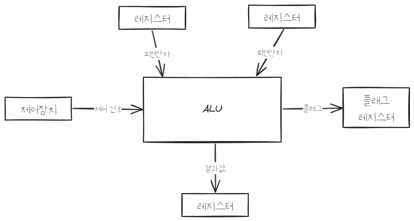

> [!info] CPU가 메모리에 접근하는 것보다 레지스터에 접근하는게 훨씬 빠름

[ALU](#ALU)
[제어장치](#제어장치)
[레지스터](#레지스터)
[명령어 사이클](#명령어-사이클)
[인터럽트](#인터럽트(interrupt))
[버퍼](#버퍼)
[캐시](#캐시)
[병렬 처리](#병렬-처리)
# ALU

- CPU에서 계산 담당
- ALU 내부에는 여러 계산을 위한 회로들이 있음(가산기, 보수기, 시프터, 오버플로우 검출기 등)
- 레지스터를 통해 피연산자(operand)를 받아들이고 제어장치로부터 수행할 연산을 알려주는 제어 신호를 받아들임
- 연산의 결과값을 레지스터에 보냄
- flag를 플래그 레지스터에 보냄
- flag: 연산 결과에 대한 추가적인 상태 정보
- overflow: 연산 결과가 연산 결과를 담을 레지스터보다 큰 상황

|  |  |
| ---- | ---- |
| 부호 플래그 | 부호 플래그가 1이면 연산 결과는 음수, 0이면 양수 |
| 제로 플래그 | 제로 플래그가 1이면 연산 결과는 0, 0이면 0이 아님 |
| 캐리 플래그 | 캐리 플래그가 1이면 올림수나 빌림수가 발생했음을 의미, 0이면 발생하지 않음 |
| 오버플로우 플래그 | 오버플로우 플래그가 1이면 오버플로우 발생, 0이면 아님 |
| 인터럽트 플래그 | 인터럽트 플래그가 1이면 인터럽드가 가능함을 의미, 0이면 불가능 |
| 슈퍼바이저 플래그 | 슈퍼바이저 플래그가 1이면 커널 모드로 실행중임을 의미, 0이면 사용자 모드로 실행 중임을 의미 |
# 제어장치
- CPU 제조사마다 제어장치의 구현 방식이나 명령어 해석 방식, 받고 내보내는 정보가 다름
## 제어장치가 받아들이는 정보
- **클럭 신호**: 컴퓨터의 모든 부품은 클럭 신호에 맞춰 동작함
- **해석해야할 명령어**: 명령어 레지스터로부터 해석할 명령어를 받아들이고 해석한 뒤, 제어 신호를 발생시켜 컴퓨터 부품들에 수행해야 할 내용을 알려줌
- **플래그 값**: 플래그 레지스터에 저장된 플래그 값을 받아들임
- **제어 버스로 전달된 제어 신호**: CPU가 아닌 외부로부터 발생된 제어 신호를 받아들임
## 제어장치가 내보내는 정보
- CPU 외부에 전달하는 제어 신호: 제어버스로 제어 신호를 내보냄(to 메모리, 입출력 장치)
- CPU 내부에 전달하는 제어 신호(to 레지스터, ALU)
# 레지스터
- 레지스터는 CPU 내부에 위치함
- 프로그램 속 명령어와 데이터는 실행 전후로 반드시 레지스터에 저장됨
- 레지스터에 저장된 값만 잘 관찰해도 프로그램의 실행 흐름 파악 가능
## 대부분의 CPU가 공통으로 가진 레지스터
- **프로그램 카운터(명령어 포인터)**: 메모리에서 읽을 명령어의 주소 저장, 저장된 주소 값이 지속적으로 증가하기 때문에 CPU가 메모리에 저장된 프로그램을 순차적으로 읽고 실행할 수 있음
	- 순차적인 실행 흐름이 끊기는 경우: 특정 메모리 주소로 이동하는 명령어가 실행되거나 인터럽트가 발생했을때
- **명령어 레지스터**: 명령어 저장
- **메모리 주소 레지스터**: 메모리 주소 저장, CPU가 읽을 주소 값을 주소 버스로 보낼때 거치는 곳
- **메모리 버퍼 레지스터(메모리 데이터 레지스터)**: 메모리와 주고받을 값 저장, 데이터 버스로 주고받을 값이 거치는 곳
- **범용 레지스터**: 자유롭게 사용할 수 있는 레지스터, 데이터와 주소 모두 저장 가능
- **플래그 레지스터**: ALU 연산 결과나 CPU 상태에 따른 플래그 저장
- **스택 포인터**: 메모리 내부 스택 영역의 peek를 가리키는 레지스터, 스택 주소 지정 방식에 사용됨
- **베이스 레지스터**: 변위 주소 지정 방식에 사용됨
## ARM 레지스터
- 13개의 범용 레지스터: R0 ~ R12
- 스택 포인터: SP (R13), ARM 상태에서 범용 레지스터로 사용될 수 있음
- 링크 레지스터: LR (R14) 함수 호출 등의 서브루틴에서 되돌아갈 주소 저장, 범용 레지스터로서 사용될 수도 있음
- 프로그램 카운터: PC (R15)
- 프로그램 상태 레지스터(≈플래그 레지스터): CPSR 
- ARM 상태(ARM state): ARM에서는 명령어를 실행할 때 ARM 상태로 실행할 수 있고, Thumb 상태로 실행할 수 있는데, 전자는 32비트 명령어를 실행하는 모드이고 후자는 16비트 명령어를 실행하는 모드다. 그렇기에 Thumb 상태에서는 ARM 상태로 명령어를 실행할 때에 비해 적은 명령어를 사용한다. 
	- Thumb 모드에서는 R0~R7(범용 레지스터 8개), R13(SP), R14(LR), R15(PC) 레지스터를 사용한다.
	- ARM mode는 이보다 많은 R0~R12까지 모두 사용할 수 있다.
- ARM은 실행 모드에 따라 사용되는 레지스터 종류가 달라짐
	- User mode: 사용자 모드로 실행할때의 동작 모드
	- FIQ(Fast Interrupt Request) mode: 빠르게 처리해야하는 인터럽트를 처리하기 위한 동작 모드
	- IRQ(Interrupt Request) mode: 일반적인 인터럽트를 처리하기 위한 동작 모드
	- SVC(Supervisor) mode: 자원에 접근할 수 있는 동작 모드
	- Abort mode: 예기치 못한 오류가 발생했을때 동작 모드
	- Undefined: 정의되지 않은 명령어를 수행하려 할때 동작 모드
	- System mode: 사용자 모드에서 추가적인 권한을 더 부여한 실행 모드
## x86(x86-64) 레지스터
16비트로 사용될때
- AX(Accumulator register): 산술 연산에 사용
- CX (Counter register): 시프트/회전 연산과 루프에서 사용
- DX (Data register): 산술 연산과 I/O 명령에서 사용
- BX (Base register): 데이터의 주소를 가리키는 포인터로 사용
- SP (Stack Pointer register): 스택의 최상단을 가리키는 포인터로 사용
- BP (Stack Base Pointer register): 스택의 베이스(최하단)를 가리키는 포인터로 사용
- SI (Source Index register): 스트림 명령에서 소스를 가리키는 포인터로 사용
- DI (Destination Index register): 스트림 명령에서 도착점을 가리키는 포인터로 사용
- IP (Instruction Pointer): 명령어 포인터
- EFLAGS: 플래그 레지스터
32비트로 사용될때는 레지스터 이름 앞에 'E' 붙임
64비트로 사용될때는 'R' 붙임
- 세그먼트 레지스터: 주소 지정에서 사용되는 레지스터
	- Stack Segment (SS): 스택을 가리킴
	- Code Segment (CS): 코드를 가리킴
	- Data Segment (DS): 데이터를 가리킴
	- Extra Segment (ES): 추가적인 데이터를 가리킴
	- F Segment (FS): 많은 추가적인 데이터를 가리킴
	- G Segment (GS): 더 많은 추가적인 데이터를 가리킴

# 명령어 사이클
- CPU가 하나의 명령어를 처리할때 명령어가 일정한 **주기**를 반복하며 실행됨
- 하나의 명령어가 처리되는 **주기**를 명령어 사이클이라고 함
1. 인출 사이클(fetch cycle): 메모리에 있는 명령어를 CPU로 가져옴
2. 실행 사이클(execution cycle): CPU로 가져온 명령어 실행
3. 간접 사이클(indirect cycle): 메모리 접근이 더 필요한 경우(e.g. 간접 주소 지정 방식)
- CPU는 명령어를 가져오고 실행하고를 반복함(1, 2를 반복하거나 1,3,2를 반복함)

# 인터럽트(interrupt)
- CPU의 정상적인 작업을 방해하는 신호
- 인터럽트의 종류를 구분하는 통일된 기준 없음(아래는 인텔 공식 문서 참조한 기준임)
## 동기 인터럽트(== exception)
- CPU에 의해 발생하는 인터럽트로, 명령어들을 수행하다가 예외적인 상황에 마주 쳤을때 발생
- **fault**: 예외 처리 직후 예외가 발생한 명령어부터 실행하는 예외
- **trap**: 예외 처리 직후 예외가 발생한 명령어의 다음 명령어부터 실행하는 예외(e.g. 디버깅)
- **abort(중단)**: CPU가 실행 중인 프로그램을 강제로 중단시킬 수 밖에 없는 심각한 오류를 발견했을때 발생하는 예외
- **소프트웨어 인터럽트**: 시스템 호출이 발생했을때 나타나는 예외
## 비동기 인터럽트
- 주로 입출력장치에 의해 발생하는 인터럽트
- 입출력장치에 의한 비동기 인터럽트는 '알림' 역할을 함
- CPU는 효율적인 작업을 위해 비동기 인터럽트를 사용함
	- e.g. 프린터 출력 명령 후 프린트가 끝날때까지 주기적으로 완료 여부를 확인하는 대신, 프린트로부터 완료 인터럽트를 받아 효율적인 작업 가능
- **인터럽트 플래그**: 플래그 레지스터에 있는 인터럽트 비트, 활성화(가능)되있어야 인터럽트 요청 신호를 받아들임. 비활성화되있으면 인터럽트 요청 신호 무시
- 막을 수 없는 인터럽트(Maskable Interrupt): 우선순위가 가장 높은, 무시할 수 없는 인터럽트
- 막을 수 있는 인터럽트(Non Maskable Interrupt)
- **인터럽트 서비스 루틴**(인터럽트 핸들러): 인터럽트를 처리하기 위한 **프로그램**
- **인터럽트 벡터**: 인터럽트 서비스 루틴의 시작 주소를 알려줌
	- CPU는 인터럽트 요청을 보낸 대상으로부터 데이터 버스를 통해 인터럽트 벡터를 전달받음
- CPU는 인터럽트 서비스 루틴을 실행하기 전에 지금까지의 작업 내역들을 메모리의 스택 영역에 백업함
### CPU의 비동기 인터럽트 처리 순서
1. 입출력장치는 CPU에 인터럽트 요청 신호를 보냄
2. CPU는 실행 사이클이 끝나고 명령어를 인출하기 전 항상 인터럽트 여부 확인
3. CPU는 인터럽트 요청을 확인하고 인터럽트 플래그를 통해 현재 인터럽트를 받아들일 수 있는지 여부 확인
4. 인터럽트를 받아들일 수 있다면 CPU는 지금까지의 작업을 백업
5. CPU는 인터럽트 벡터를 참조해 인터럽트 서비스 루틴 실행
6. 인터럽트 서비스 루틴 실행이 끝나면 4에서 백업해둔 작업을 복구해 실행 재개
# 버퍼
- 일정량의 **데이터를 모아 한꺼번에 전송**함으로써 장치간 속도 차이 완화
- 하드디스크는 버퍼 용량이 클수록 빠름
- 동영상 스트리밍에서도 동영상 데이터의 일정 부분을 버퍼에 넣은 후 실행
- C언어의 `printf("\n")`는 줄바꿈뿐만 아니라 버퍼에 저장된 내용을 출력하므로 `printf()`를 사용할때 마지막에 "\n"을 붙이면 좋음
## spool
- CPU와 입출력 장치가 독립적으로 동작하도록 하는 소프트웨어적인 버퍼
- 버퍼는 어떤 데이터가 들어가든지 버퍼가 차면 이동하므로 프로그램간에 버퍼를 공유함
- 스풀은 프로그램간에 공유 불가
# 캐시
- 메모리와 CPU간의 속도 차이를 완화하기 위해 메모리의 데이터를 미리 가져와 저장해두는 임시 장소로, 버퍼의 일종임
- cache hit: CPU가 캐시에서 원하는 데이터를 찾은 경우
- cache miss: 캐시에 원하는 데이터가 없는 경우
- cache hit ratio: 캐시 적중률
- 캐시 적중률을 높이려면 캐시 크기를 늘리거나 지역성 이론에 따라 앞으로 많이 사용될 데이터를 가져옴
- 캐시에 있는 데이터가 변경되면 메모리에 있는 원본 데이터를 수정해야함
	- 즉시 쓰기: 캐시 데이터가 변경되면 즉시 메모리에 반영, 메모리에 최신 값이 항상 유지되지만 시스템 성능 느려짐
	- 지연 쓰기: 캐시 데이터가 변경된 내용을 모아 주기적으로 메모리에 반영, 시스템 빨라지지만 메모리와 캐시간 데이터 불일치 발생 가능
- L1 캐시: 명령어 캐시나 데이터 캐시등 CPU 레지스터에 직접 연결되는 캐시
- L2 캐시: 메모리와 연결되는 일반 캐시
## 소프트웨어적 캐시
- 웹 브라우저의 캐시는 방문했던 사이트의 데이터를 보관해 재방문시 속도 높임
- 너무 많은 데이터가 캐시에 보관되면 웹 브라우저 속도 저하
# 병렬 처리
- 여러 개의 명령을 동시에 처리
## 병렬 처리 시 고려사항
- 명령들간 상호 의존성이 없어야함
- 각 단계의 작업 시간이 일정해야함
- 전체 작업을 몇 단계로 쪼갤지 잘 따져야함
	- 병렬 처리의 깊이: 작업을 N개로 쪼갰을때 N
	- 병렬 처리의 깊이가 클수록 동시에 작업할 수 있는 작업 개수가 많아져 성능이 높아지지만, 깊이가 너무 크면 각 작업 단계를 이동하고 새로운 단계를 불러오는데 오래 걸림
## 파이프라인 기법
- 하나의 코어에 여러 개의 스레드 이용한 CPU 멀티스레드
- CPU 한 클럭마다 하나의 명령어 실행
- 명령어를 여러 개의 단계로 분할 후, 각 단계를 동시에 처리하는 스레드를 독립적으로 구성해 각 단계가 쉬지 않고 명령어 처리
### 데이터 위험
- 이전 명령어의 결과가 다음 명령어에 필요한 경우 발생하는 데이터 의존성 문제
- 파이프라인의 명령어 단계를 지연해 해결
### 제어 위험
- if문, goto문처럼 프로그램 카운터 값이 갑자기 변해 동시에 처리되고 있던 명령어들이 쓸모 없어지는 문제
- 분기 예측이나 분기 지연 방법으로 해결
### 구조 위험
- 서로 다른 명령어가 같은 자원에 접근할때 발생
## 슈퍼스칼라 기법
- 파이프라인을 처리할 수 있는 코어를 여러 개 구성해 복수의 명령어가 동시에 실행되는 방식
- 하나의 작업 단계에서 코어 개수만큼의 명령어 실행
## 슈퍼파이프라인 기법
- 파이프라인의 각 단계를 세분화해 한 클럭 내에 여러 명령어 처리
## 슈퍼파이프라인 슈퍼스칼라 기법
- 슈퍼파이프라인 기법을 여러 개의 코어에서 동시에 수행
## VLIW(very long instruction word)
- CPU가 병렬 처리를 지원하지 않을때 소프트웨어적으로 병렬 처리
- 동시에 수행할 수 있는 명령어들을 컴파일러가 추출하고 하나의 명령어로 압축해 실행

# ISA(Instruction Set Architecture; 명령어 집합 구조)
- ISA는 CPU가 명령어를 이해하는 체계로, CPU의 언어라고 볼 수 있다.
- 명령어를 빠르게 처리하기 위해 명령어 파이프라인을 적극적으로 활용해야 한다.
- 원활한 파이프라이닝을 위해 명령어 길이와 수행 시간이 짧고 규격화 되어 있어야 한다.
- 복잡한 기능을 지원하는 명령어를 추가하기 보다 자주 쓰이는 명령어를 작고 빠르게 만드 
## CISC()
- 복잡하고 다양한 명령어
- 가변 길이 명령어
- 다양한 주소 지정 방식
- 컴파일된 코드가 적음
- 여러 클럭에 걸쳐 명령어 수행
- 파이프라이닝하기 어려움
## RISC(Reduced Instruction Set Computer)
- 단순하고 적은 명령어
- 고정 길이 명령어
- 적은 주소 지정 방식
- 컴파일된 코드가 많음
- 1 클럭 내외로 명령어 수행
- 파이프라이